&emsp;&emsp;《Unix网络编程：进程通信》阅读笔记。
&emsp;&emsp;操作系统中每个进程都是独立的资源分配的最小单位，互相是隔离的。进程通信就是为了使得不同进程之间互相访问资源并进行协调工作。
&emsp;&emsp;需要注意的是示例代码中所有以```l```开头的代码都是经过封装的库函数，和库函数的功能没有区别，比如:
```c
int lwrite(int writefd, char *buff, int len)
{
    int ret = write(writefd, buff, len);
    ERROR_CHECK(ret, <, 0, writefd, "write data into %d failed!");    
    return ret;
}
```
&emsp;&emsp;同步和异步IO的概念：
- 同步是用户线程发起I/O请求后需要等待或者轮询内核I/O操作完成后才能继续执行；
- 异步是用户线程发起I/O请求后仍需要继续执行，当内核I/O操作完成后会通知用户线程，或者调用用户线程注册的回调函数。

&emsp;&emsp;阻塞和非阻塞IO的概念：
- 阻塞是指I/O操作需要彻底完成后才能返回用户空间；
- 非阻塞是指I/O操作被调用后立即返回一个状态值，无需等I/O操作彻底完成。

# 1 管道
## 1.1 无名管道
### 1.1.1 简介
&emsp;&emsp;在类Unix操作系统（以及一些其他借用了这个设计的操作系统，如Windows）中，管道是一系列将标准输入输出链接起来的进程，其中每一个进程的输出被直接作为下一个进程的输入。管道，顾名思义，就是数据会在管道中从一端流向另一端，因此是半双工的，即同一个管道只能有一个读端和写段。当然也有支持全双工管道的操作系统，但是日常中主流依然是linux和windows因此不做讨论。
&emsp;&emsp;最简单的例子就是```linux shell```中如```cat filename | sort```其中```cat filename```的输出会作为```sort```的输入。其中特殊的“|”字符告诉命令行解释器（Shell）将前一个命令的输出通过“管道”导入到接下来的一行命令作为输入。
### 1.1.2 相关api
#### 1.1.2.1 ```pipe```
```c
#include <unistd.h>
int pipe(int pipefd[2]);
```
- ```pipe```接受一个两个元素的数组，创建匿名管道；
  - 该管道的读描述符存放在```pipefd[0]```中；
  - 写描述符存放在```pipefd[1]```中；
- 返回值；
  - 0   表示成功；
  - -1   表示失败，并且设置```errno```。

&emsp;&emsp;通过```pipe```创建的管道如下图所示：


&emsp;&emsp;既然管道是用来进行进程通信的，那么一个进程如何获取另一个进程创建的管道描述符？无法直接获取因为是匿名管道，只能通过```fork```共享文件描述符。因此可以看到匿名管道只能进行具有共同祖先的进程之间的通信。

&emsp;&emsp;下面的示例是一个单客户端，单服务器，具体功能是父进程作为客户端，向服务器发送一个文件路径名；子进程作为服务端接收到文件路径名之后读取其中的数据并将该数据返回给客户端，客户端进行回显。

```c
void pipe_client(int readfd, int writefd)
{
    char buff[MAX_LEN] = {0};
    lfgets(buff, MAX_LEN, stdin);
    int len = strlen(buff);
    if(buff[len - 1] == '\n')
        len--;
        
    lwrite(writefd, buff, len);
    while((len = lread(readfd, buff, MAX_LEN) > 0))
    {
        //lwrite(stdout, buff, len);
        printf(buff);
    }
}

/*
 * @brief   客户端发送过来的是一个路径名，服务端尝试打开该文件并将文件中的数据写入管道发送给客户端
 */
void pipe_server(int readfd, int writefd)
{
    char buff[MAX_LEN] = {0};
    int ret = 0;
    //int ret = lread(readfd, buff, MAX_LEN);
    ret = lread(readfd, buff, MAX_LEN);
    if(ret == 0)
    {
        safe_exit("come into the end of stream!\n");
    }
    
    buff[ret] = '\0';
    int fd = lopen(buff, O_RDONLY);
    while((ret = lread(fd, buff, MAX_LEN)) > 0)
    {
        lwrite(writefd, buff, ret);
    }
    
    lclose(fd);
}

void pipe_test()
{
    int fd1[2] = {0};        //0 write 1 read
    int fd2[2] = {0};
    pid_t pid;
    
    lpipe(fd1);
    lpipe(fd2);
    pid = lfork();
    if(pid == 0)  //子进程
    {
        lclose(fd1[1]);
        lclose(fd2[0]);
        pipe_server(fd1[0], fd2[1]);
        safe_exit(NULL);
    }
    else
    {
        lclose(fd1[0]);
        lclose(fd2[1]);
        pipe_client(fd2[0], fd1[1]);
        lwaitpid(pid, NULL, 0);
    }
}
```
&emsp;从示例中可以看到，进程创建了两个匿名管道，文件描述符分别保存于```fd1,fd2```，随后父子进程分别关闭一个的读端和另一个的写端。由于linux中万物皆未文件，因此对管道的操作和对文件的操作无异。父子进程的数据交互模型如下所示：


#### 1.1.2.2 ```popen```
```c
#include <stdio.h>
FILE *popen(const char *command, const char *type);
int pclose(FILE *stream);
```
- ```popen```：创建一个管道并启动一个进程执行命令```command```，该进程要么从管道读取标准输入，要么从管道写入标准输出；
  - ```command```：接受一个shell命令行；
  - ```type```：表示进程如何操作管道：
    - ```"w"```：调用进程读写```command```的标准输入；
    - ```"r"```：调用进程读进```command```的标准输出；
  - 返回值```NULL```，失败；
  - 返回值非```NULL```，成功；
- ```pclose```：关闭通过```popen```打开的文件描述符；
  - 返回值-1，关闭失败；
  - 返回值0，关闭成功。

&emsp;&emsp;下面的例子：用户输入一个命令，通过```popen```打开管道读取该命令的输出。
```c
void popen_test()
{
    char buff[MAX_LEN] = {0};
    lfgets(buff, MAX_LEN, stdin);
    int fd = lpopen(buff, "r");
    while(lfgets(buff, MAX_LEN, fd) != NULL)
    {
        printf(buff);
    }
    
}
```
## 1.2 有名管道
### 1.2.1 简介
&emsp;&emsp;命名管道是计算机进程间的一种先进先出通信机制。是类Unix系统传统管道的扩展。传统管道属于匿名管道，其生存期不超过创建管道的进程的生存期。但命名管道的生存期可以与操作系统运行期一样长。

### 1.2.2 相关API
```c
#include <sys/types.h>
#include <sys/stat.h>
int mkfifo(const char *pathname, mode_t mode);
int unlink(const char *pathname);
```
- ```mkfifo```创建一个有名管道，该管道拥有一个系统上的路径名，因此不同进程之间可以通过该路径名读写管道；
  - ```pathname```：与管道相关联的路径名；
  - ```mode```：文件权限；
  - 返回值-1：创建失败；
  - 返回值0：创建成功；
- ```unlink```：从系统中删除该有名管道，这里需要理清不同进程之间的关系防止其他进程在操作数据之前就管道被其他进程删除；
  - ```pathname```：管道的路径名；
  - 返回值 -1：创建失败；
  - 返回值0：创建成功。

&emsp;&emsp;通过```mkfifo```创建管道时，在管道被删除之前会在文件系统上创建一个文件,如果使用```ls -l```查看该文件的属性会看到如下，文件首字母是```p```表示是一个管道文件。
```bash
prw-rw-r-- 1 grayondream grayondream    0 9月   2 12:28 fater
```
### 1.2.3 示例
&emsp;&emsp;下面的示例是在匿名管道上的进程通信的基础上修改的，只是把匿名管道更换为有名管道，功能类似。
```c
void mkfifo_test()
{
    char *file1 = "./father";
    char *file2 = "./child";
    int mode = S_IRUSR | S_IWUSR | S_IRGRP | S_IWGRP;
    
    lmkfifo(file1, mode);
    lmkfifo(file2, mode);
    
    pid_t id = fork();
    if(id == 0) //子进程
    {
        int read_fd = lopen(file1, O_RDONLY);
        int write_fd = lopen(file2, O_WRONLY);
        pipe_server(read_fd, write_fd);
        
        lclose(read_fd);
        lclose(write_fd);
        safe_exit(NULL);
    }
    else
    {
        int write_fd = lopen(file1, O_WRONLY);
        int read_fd = lopen(file2, O_RDONLY);
        pipe_client(read_fd, write_fd);
        lwaitpid(id, NULL, 0);
        
        lclose(read_fd);
        lclose(write_fd);
        
        lunlink(file1);
        lunlink(file2);
        safe_exit(NULL);
    }
}
```

&emsp;&emsp;下面的示例是对上面示例的一个小修改，将程序分离成了两个单独的进行。
```c
//client
void mkfifo_client_process()
{
    char *file1 = "./father";
    char *file2 = "./child";
    int mode = S_IRUSR | S_IWUSR | S_IRGRP | S_IWGRP;
    
    lmkfifo(file1, mode);
    lmkfifo(file2, mode);
    
    int write_fd = lopen(file1, O_WRONLY);
    int read_fd = lopen(file2, O_RDONLY);
    pipe_client(read_fd, write_fd);
    
    lclose(read_fd);
    lclose(write_fd);
    
    lunlink(file1);
    lunlink(file2);
    safe_exit(NULL);
    
}
```

```c
//server
void mkfifo_server_process()
{
    char *file1 = "./father";
    char *file2 = "./child";
    int mode = S_IRUSR | S_IWUSR | S_IRGRP | S_IWGRP;
    
    lmkfifo(file1, mode);
    lmkfifo(file2, mode);
    
    int read_fd = lopen(file1, O_RDONLY);
    int write_fd = lopen(file2, O_WRONLY);
    pipe_server(read_fd, write_fd);
    
    lclose(read_fd);
    lclose(write_fd);
    safe_exit(NULL);
}
```

&emsp;&emsp;下面是上面程序的进阶版本，程序的模型是单服务器多客户端，服务器拥有管道```/home/grayondream/altas/ipc/build/tmp/server```，每个客户端都有一个自己的管道```/home/grayondream/altas/ipc/build/tmp/client.id```，基本流程为：
1. 用户在服务器端输入id+空格+路径名，其中id占两个字节即只能是两位数，范围为[0,99]；
2. 服务端将该文件路径写入到管道```/home/grayondream/altas/ipc/build/tmp/client.id```中，比如```/home/grayondream/altas/ipc/build/tmp/client.1```；
3. 客户端通过读取自身的管道之后获得文件名，然后读取该文件并回显其中的内容，客户端向服务端发送确认信息，客户端退出；
4. 服务端进行下一轮。

```c
#define MULT_SERVER_NAME "/home/grayondream/altas/ipc/build/tmp/server"
#define MULT_CLIENT_NAME "/home/grayondream/altas/ipc/build/tmp/client.%d"

//server 通过发送id + ' ' + '文件名'的格式向指定的client发送请求，id取值范围为01-20占两个字节
void mult_fifo_server_process()
{
    printf("start server and send file into client!\n");
    int mode = S_IRUSR | S_IWUSR | S_IRGRP | S_IWGRP;
    lmkfifo(MULT_SERVER_NAME, mode);
    int server_rfd = lopen(MULT_SERVER_NAME, O_RDONLY);
    while(1)
    {
        char buff[MAX_LEN] = {0};
        lfgets(buff, MAX_LEN, stdin);
        //将文件名发送给指定的客户端
        int len = strlen(buff);
        if(buff[len - 1] == '\n')
        len--;
        
        buff[len] = '\0';
        buff[2] = '\0';
        int id = atoi(buff);
        char *ptr = buff + 3;
        
        //打开客户端的fifo
        char client[MAX_LEN] = {0};
        snprintf(client, MAX_LEN, MULT_CLIENT_NAME, id);
        lmkfifo(client, mode);
        int client_wfd = lopen(client, O_WRONLY);
        
        //将数据写入客户端的fifo
        lwrite(client_wfd, ptr, strlen(ptr));
        
        //等待客户端回传，状态
        while(lread(server_rfd, buff, MAX_LEN) > 0)
            printf(buff);
            
        printf("\n");
        lunlink(client);
    }
    
    lunlink(server_rfd);
}
```

```c
//client
void mult_fifo_client_process()
{
    printf("start client waiting for the post from server!\n");
    int id = 1;
    int mode = S_IRUSR | S_IWUSR | S_IRGRP | S_IWGRP ;
    lmkfifo(MULT_SERVER_NAME, mode);
    int server_wfd = lopen(MULT_SERVER_NAME, O_WRONLY);
    
    char client_name[MAX_LEN] = {0};
    snprintf(client_name, MAX_LEN, MULT_CLIENT_NAME, id);
    lmkfifo(client_name, mode);
    int client_rfd = lopen(client_name, O_RDONLY);
    
    char buff[MAX_LEN] = {0};
    int len = lread(client_rfd, buff, MAX_LEN);
    if(buff[len - 1] == '\n')
        len--;
        
    buff[len] = '\0';
    int fd = lopen(buff, O_RDONLY);
    while((len = lread(fd, buff, MAX_LEN)) > 0)
    {
        printf(buff);
    }
    
    //向服务器返回信息
    snprintf(buff, MAX_LEN, "%d load data from %s end!", id, client_name);
    lwrite(server_wfd, buff, MAX_LEN);
    
    lunlink(client_name);
    lunlink(MULT_SERVER_NAME);
    
    safe_exit(NULL);
}
```
&emsp;&emsp;从程序中可以看出上面的客户端服务器模型是一个迭代服务器模型即每次服务端处理一个链接，也可以采用多进程```fork```或者多线程```pthread```处理请求，即并发服务器。

## 1.3 管道和FIFO的其他属性和限制
&emsp;&emsp;管道的打开和文件的操作无异，当管道被打开之后可以通过api```fcntl```修改文件的属性。
```c
#include <unistd.h>
#include <fcntl.h>
int fcntl(int fd, int cmd, ... /* arg */ );
```

&emsp;&emsp;管道或者FIFO的读取和写入的若干规则：
- 如果读取请求的数据量多于管道或者FIFO中的数据量，那么只返回其中的数据；
- 如果写入的数据字节数小于或者等于```PIPE_BUF```(Posix限制)，那么```write```能够保证是原子的；否则无法保证是原子的；
- 设置```O_NONBLOCK```即非阻塞，并不会对```write```原子性有影响，当设置非阻塞：
  - 写的字节数小于等于```PIPE_BUF```：
    - 如果管道或者FIFO中有足够存放请求字节数的空间，则所有数据写入；
    - 如果管道或者FIFO中没有足以存放请求字节数的空间，则立即返回一个```EAGAIN```错误；
  - 写入的字节数大于```PIPE_BUF```：
    - 如果管道或者FIFO中至少有一个字节的空间，则写入管道或者FIFO中能够容纳的数据；
    - 如果管道已经满了，则立即返回一个```EAGAIN```错误。
- 如果向没有为读打开的管道或者FIFO写入，那么内核产生```SIGPIPE```信号：
  - 如果进程未捕捉也未忽略该信号，则默认行为为终止程序；
  - 如果进程捕捉或者忽略了该信号并从信号处理程序中返回，则```write```返回一个```EPIPE```错误。

&emsp;&emsp;管道和FIFO的限制:
- ```OPEN_MAX```：每个进程可以打开的最大描述符数量；
- ```PIPE_BUF```：可原子的写管道或者FIFO的字节数。


# 2 消息队列
## 2.1 简介
&emsp;&emsp;消息队列是一种进程间通信或同一进程的不同线程间的通信方式，软件的贮列用来处理一系列的输入，通常是来自用户。消息队列提供了异步的通信协议，每一个贮列中的纪录包含详细说明的数据，包含发生的时间，输入设备的种类，以及特定的输入参数，也就是说：消息的发送者和接收者不需要同时与消息队列交互。消息会保存在队列中，直到接收者取回它。
&emsp;&emsp;消息队列的实现可以看做一个消息的链表，有权限的进程或者线程向该队列中添加消息，有权限的进程或者线程从队列中取出消息。写消息的线程或者进程与读消息的进程或线程是异步的。消息队列是随内核持续的，即进程终止消息队列依然存在，除非显式的删除队列。
&emsp;&emsp;消息队列的实现分为Posix消息队列和System V消息队列，具体区别如下：
- Posix消息队列总是返回最高优先级最早的消息；System V消息队列返回任意指定优先级的消息；
- 当向一个空消息队列中添加消息时，Posix消息队列允许产生一个信号或者启动一个线程；System V则无；

&emsp;&emsp;消息队列的每个条目包含：
- 优先级；
- 消息长度（可以为0）；
- 数据(如果长度大于0)；


## 2.2 Posix消息队列
### 2.2.1 消息队列
```c
#include <mqueue.h>
mqd_t mq_open(const char *name, int oflag, mode_t mode, struct mq_attr *attr);  //需要链接库 -lrt
```
&emsp;&emsp;创建或者打开一个已经存在的消息队列:
- ```name```：消息队列的名称需要符合Posix标准，一般为```/***```；
- ```oflag```：打开文件的模式，比如```ORDONLY```等；
- ```mode```：打开文件的权限；
- ```attr```：消息队列的属性，具体见下。
- 返回值-1出错，成功则返回消息队列的描述符。

```c
struct mq_attr 
{
    long mq_flags;       /* Flags: 0 or O_NONBLOCK */
    long mq_maxmsg;      /* Max. # of messages on queue */
    long mq_msgsize;     /* Max. message size (bytes) */
    long mq_curmsgs;     /* # of messages currently in queue */
};
```
&emsp;&emsp;属性参数的四个元素分别表示：
- ```mq_flags```：消息队列的属性，0或者```O_NONBLOCK```；
- ```mq_maxmsg```：支持的最大消息数；
- ```mq_msgsize```：消息数据的最大size；
- ```mq_curmsgs```：当前消息队列的消息数。

```c
int mq_close(mqd_t mqdes);
```
&emsp;&emsp;关闭一个消息队列，表示该描述符失效，但并不会从系统中删除消息队列。
- ```mqdes```：消息队列的描述符，通过```mq_open```获得。

```c
int mq_unlink(const char *name);
```
&emsp;&emsp;删除消息队列：
- ```name```：消息队列的名字。
  

&emsp;&emsp;消息队列本身维护了一个引用计数，当一个进程打开消息队列时引用计数加一，关闭时减一，只有当引用计数为0时才会真正删除。

```c
int mq_getattr(mqd_t mqdes, struct mq_attr *attr);
int mq_setattr(mqd_t mqdes, const struct mq_attr *newattr,struct mq_attr *oldattr);
```
&emsp;&emsp;两个api的含义顾名思义，分别是获取和设置消息队列的属性：
- ```mqdes```：消息队列的描述符；
- ```attr```：属性变量地址；
- ```newattr```：要设置的参数值；
- ```oldattr```：设置之后之前的属性值；
- 返回-1表示出错，0表示成功。

```c
int mq_send(mqd_t mqdes, const char *msg_ptr, size_t msg_len, unsigned int msg_prio);
```
&emsp;&emsp;向消息队列中添加消息：
- ```mqdes```：消息队列的描述符；
- ```msg_ptr```：数据的指针；
- ```msg_len```：数据尺寸；
- ```msg_prio```：当前消息的优先级，要求必须小于```MQ_PRIO_MAX```；
- 返回值：0成功，-1失败。

```c
ssize_t mq_receive(mqd_t mqdes, char *msg_ptr, size_t msg_len, unsigned int *msg_prio);
```
&emsp;&emsp;从消息队列中优先级最高最早的消息：
- ```mqdes```：消息队列的描述符；
- ```msg_ptr```：数据的指针；
- ```msg_len```：数据尺寸；
- ```msg_prio```：获取的消息优先级；
- 返回值：非-1表示获取的数据的字节数；-1失败。

```c
int mq_notify(mqd_t mqdes, const struct sigevent *sevp);
```
&emsp;&emsp;允许进程注册或者注销异步事件通知。
- ```mqdes```：消息队列的描述符；
- ```sevq```：要注册的信号事件：
  - 如果```sevp==NULL```，则当前进程希望在有一个消息到达指定先前为空的消息队列时得到通知；
  - 如果```sevq!=NULL```，则当前进程被注册为接受所只是队列的通知，已经存在的注册会被注销；
  - 任意时刻只能有一个进程被注册为接收某个队列的通知；
  - 当有一个消息到达某个先前为空的队列，并且已经有一个进程被注册为接收该队列的通知时，只有没有任何线程只在阻塞该队列的```mq_receive```调用中的前提下，通知才会发出。即```mq_receive```调用中的阻塞优先级比任何通知都高；
  - 如果通知被发送给他的注册程序时，其注册即被注销。该进程必须再次调用```mq_notify```注册。

```c
union sigval {          /* Data passed with notification */
    int     sival_int;         /* Integer value */
    void   *sival_ptr;         /* Pointer value */
};

struct sigevent {
    int          sigev_notify;                           /* Notification method */
    int          sigev_signo;                            /* Notification signal */
    union sigval sigev_value;                            /* Data passed with notification */
    void       (*sigev_notify_function) (union sigval);  /* Function used for thread notification (SIGEV_THREAD) */
    void        *sigev_notify_attributes;                /* Attributes for notification thread (SIGEV_THREAD) */
    pid_t        sigev_notify_thread_id;                 /* ID of thread to signal (SIGEV_THREAD_ID) */
};
```

&emsp;&emsp;消息队列的限制：
- ```mq_mqxmsg```:消息队列中的最大消息数；
- ```mq_msgsize```：消息队列中给定消息的最大字节数。
- ```MQ_OPEN_MAX```：一个进程能够同时打开的消息队列最大数目（Posix=8）；
- ```MQ_PRIO_MAX```：任意消息的最大优先级+1(Posix>=32).

### 2.2.2 信号
&emsp;&emsp;信号（英语：Signals）是Unix、类Unix以及其他POSIX兼容的操作系统中进程间通讯的一种有限制的方式。它是一种异步的通知机制，用来提醒进程一个事件已经发生。当一个信号发送给一个进程，操作系统中断了进程正常的控制流程，此时，任何非原子操作都将被中断。如果进程定义了信号的处理函数，那么它将被执行，否则就执行默认的处理函数。
&emsp;&emsp;信号类似于中断，不同之处在于中断由处理器调解并由内核处理，而信号由内核调解(可能通过系统调用)并由进程处理。内核可以将中断作为信号传递给导致中断的进程(典型的例子有SIGSEGV、SIGBUS、SIGILL和SIGFPE)。
&emsp;&emsp;Unix的信号分为：
- 实时信号：取值范围为```SIGRTMIN```到```SIGRTMAX```之间，Posix要求至少提供```RTSIG_MAX```种信号；
- 其他信号：无法实时性行为的信号。

&emsp;&emsp;对于实时信号在安装信号处理程序时必须给```sigaction```指定```SA_SIGINFO```标志。
&emsp;&emsp;Unix系统中的实时性含义为：
- 信号是排队的；
- 当有多个```SIGRTMIN-SIGRTMAX```之间的信号解阻塞排队时，值较小的优先进行信号递交；
- 当某个非实时信号递交时，传递给它的信号处理程序唯一的参数是该信号的值，实时信号比其他信号携带更多的信息，通过设置```SA_SIGINFO```标志的实时信号处理程序格式如下；
- 一些新函数定义为使用实时信号工作。
```
void func(int signo, siginfo_t *info, void *context);
siginfo_t {
    int      si_signo;     /* Signal number */
    int      si_errno;     /* An errno value */
    int      si_code;      /* Signal code */
    int      si_trapno;    /* Trap number that caused
                                hardware-generated signal
                                (unused on most architectures) */
    pid_t    si_pid;       /* Sending process ID */
    uid_t    si_uid;       /* Real user ID of sending process */
    int      si_status;    /* Exit value or signal */
    clock_t  si_utime;     /* User time consumed */
    clock_t  si_stime;     /* System time consumed */
    sigval_t si_value;     /* Signal value */
    int      si_int;       /* POSIX.1b signal */
    void    *si_ptr;       /* POSIX.1b signal */
    int      si_overrun;   /* Timer overrun count;
                                POSIX.1b timers */
    int      si_timerid;   /* Timer ID; POSIX.1b timers */
    void    *si_addr;      /* Memory location which caused fault */
    long     si_band;      /* Band event (was int in
                                glibc 2.3.2 and earlier) */
    int      si_fd;        /* File descriptor */
    short    si_addr_lsb;  /* Least significant bit of address
                                (since Linux 2.6.32) */
    void    *si_call_addr; /* Address of system call instruction
                                (since Linux 3.5) */
    int      si_syscall;   /* Number of attempted system call
                                (since Linux 3.5) */
    unsigned int si_arch;  /* Architecture of attempted system call
                                (since Linux 3.5) */
}

```

### 2.2.3 示例程序
#### 2.2.3.1 创建和销毁消息队列
&emsp;&emsp;通过参数控制消息队列的创建和删除，基本格式为```cmd c name```，其中c可以为```c或者d```分别表示创建和删除，```name```为消息队列，比如```/message```，该文件会存放在```/dev/mqueue```。
```c
//获取2个参数
//c 表示创建消息队列 d表示删除消息队列
//第二个参数为消息队列的路径
void handle_msg(int argc, char **argv)
{
    if(argc != 3)
        err_exit(NULL, -1);
    
    mqd_t fd = 0;
    int flag = O_RDWR | O_CREAT;
    char ch = argv[1][0];
    switch(ch)
    {
    case 'c':
        fd = lmq_open(argv[2], flag, 666,NULL); ///dev/mqueue/
        lmq_close(fd);
        break;
    case 'd':
        lmq_unlink(argv[2]);
        break;
    default:
        err_exit("unknown parameters!", -1);
    }
    
}
```

&emsp;&emsp;执行结果如下：
```bash
➜  build git:(master) ✗ ./main c /oppo
➜  build git:(master) ✗ ll /dev/mqueue/     
total 0
--w--wx--T 1 grayondream grayondream 80 9月   3 14:59 oppo
➜  build git:(master) ✗ ./main d /oppo 
➜  build git:(master) ✗ ll /dev/mqueue/
total 0
➜  build git:(master) ✗
```

#### 2.2.3.2 单服务器单客户端同步通信
&emsp;&emsp;下面的程序通过参数控制当前进程是服务器还是客户端，基本命令格式为```cmd [c/s] name```，第二个参数```c,s```分别指代客户端还是服务器，```name```为消息队列的名称。基本功能为客户端启动之后读取标准输入，标准输入的格式为优先级+空格+消息，优先级占两位（纯粹为了编码方便，懒得再处理），将消息写入到消息队列中，之后启动服务端读取消息。
```c
//程序分为客户端和服务端，客户端发送数据，服务端接受数据
//接受2个参数，第一个c或者s表示客户端和服务端，第二个参数指定消息队列的文件名
void ipc_mq(int argc, char **argv)
{
    if(argc != 3)
        err_exit(NULL, -1);
    
    mqd_t fd = 0;
    int flag = 0;
    int mode = FILE_MODE;
    char ch = argv[1][0];
    char buff[MAX_LEN] = {0};
    int len = 0;
    int prior = 20;
    switch(ch)
    {
    case 'c':
        flag = O_CREAT | O_WRONLY;
        fd = lmq_open(argv[2], flag, mode, NULL);
        //输入的前两位为消息的优先级
        //输入的格式为优先级+空格+消息
        while(lfgets(buff, MAX_LEN, stdin) != NULL)
        {
            buff[2] = '\0';
            prior = atoi(buff);
            char *msg = buff + 3;
            len = strlen(msg);
            if(msg[len - 1] == '\n')
                len--;
            msg[len] = '\0';
            lmq_send_msg(fd, msg, len, prior);
        }
        break;
    case 's':
        flag = O_RDONLY;
        fd = lmq_open(argv[2], flag, mode, NULL);
        struct mq_attr attr;
        lmq_getattr(fd, &attr);
        printf("message size %d, max message %d\n", attr.mq_msgsize, attr.mq_maxmsg);
        while((len = lmq_receive_msg(fd, buff, attr.mq_msgsize, &prior)) > 0)
        {
            printf(buff);
            printf(" ,prior is %d!\n", prior);
        }
        
        break;
    }
    
    lmq_close(fd);
}
```
&emsp;&emsp;先启动客户端写入消息：
```bash
➜  build git:(master) ✗ ./main c /message
➜  build git:(master) ✗ ./main c /message
15 1
15 2
14 3
18 4
```
&emsp;&emsp;随后启动服务端可以看到：
```bash
➜  build git:(master) ✗ ./main s /message
message size 8192, max message 10
4 ,prior is 18!
1 ,prior is 15!
2 ,prior is 15!
3 ,prior is 14!
```
&emsp;&emsp;从上面可以看到优先返回优先级高的消息，优先级不同则优先返回最早的消息。同时消息队列获取消息默认是阻塞的。

#### 2.2.3.3 消息队列简单的信号通知
&emsp;&emsp;下面的程序通过参数控制当前进程是服务器还是客户端，基本命令格式为```cmd [c/s] name```，第二个参数```c,s```分别指代客户端还是服务器，```name```为消息队列的名称。基本功能为客户端启动之后读取标准输入，标准输入的格式为优先级+空格+消息，优先级占两位（纯粹为了编码方便，懒得再处理），将消息写入到消息队列中，之后启动服务端读取消息。
```c
mqd_t sg_mq;
struct sigevent sg_ev;
struct mq_attr sg_attr;
//信号处理函数
static void single_mq_handle(int sig_no)
{
    printf("the program come into the handler!\n");
    //这个函数并不是异步信号安全的函数
    char buff[MAX_LEN];
    int prior;
    lmq_receive_msg(sg_mq, buff, sg_attr.mq_msgsize, &prior);
    printf("receive singale and the buffer is %s, and the prior is %d!\n", buff, prior);
    lmq_notify(sg_mq, &sg_ev);         //再次注册
}

//程序分为客户端和服务端，客户端发送数据，服务端接受数据
//接受三个参数，第一个c或者s表示客户端和服务端，第二个参数指定消息队列的文件名
void single_mq_test(int argc, char **argv)
{
    if(argc != 3)
        err_exit(NULL, -1);
    
    int flag = 0;
    int mode = FILE_MODE;
    char ch = argv[1][0];
    char buff[MAX_LEN] = {0};
    int len = 0;
    int prior = 20;
    switch(ch)
    {
    case 'c':
        flag = O_CREAT | O_WRONLY;
        sg_mq = lmq_open(argv[2], flag, mode, NULL);
        //输入的前两位为消息的优先级
        //输入的格式为优先级+空格+消息
        lfgets(buff, MAX_LEN, stdin);
        
        buff[2] = '\0';
        prior = atoi(buff);
        char *msg = buff + 3;
        len = strlen(msg);
        
        if(msg[len - 1] == '\n')
            len--;
        msg[len] = '\0';
        lmq_send_msg(sg_mq, msg, len, prior);
        
        break;
    case 's':
        flag = O_RDONLY;
        sg_mq = lmq_open(argv[2], flag, mode, NULL);
        lmq_getattr(sg_mq, &sg_attr);
        lsignal(SIGUSR1, single_mq_handle);
        sg_ev.sigev_signo = SIGUSR1;
        sg_ev.sigev_notify = SIGEV_SIGNAL;
        lmq_notify(sg_mq, &sg_ev);
        for(;;)
            pause();
        break;
    }
    
    lmq_close(sg_mq);
}
```
&emsp;&emsp;运行结果如下：
```bash
➜  build git:(master) ✗ ./main c /rrrr
02 1111111111111111111111111
➜  build git:(master) ✗ ./main c /rrrr
03 22222222222222222222222222
```

```bash
➜  build git:(master) ✗ ./main s /rrrr
the program come into the handler!
receive singale and the buffer is 1111111111111111111111111, and the prior is 2!
the program come into the handler!
receive singale and the buffer is 22222222222222222222222222, and the prior is 3!
```

&emsp;&emsp;如果另外开一个进程：
```bash
➜  build git:(master) ✗ ./main s /rrrr
errno is 16,register the singal event failed!   
```
&emsp;&emsp;```#define	EBUSY		16	/* Device or resource busy *```可以看到一个消息队列同时只能被一个进程注册。
#### 2.2.3.4 异步安全的消息队列信号通知
&emsp;&emsp;这个例子是上个例子的改版，区别是保证信号异常安全。因为```mq_receive```等函数并不是信号异常安全的，如果正在执行操作被其他信号中断则会出现不可预测的现象，而利用原子性的标志位可以保证这一点。
```c
volatile sig_atomic_t sig_mask = 0;
//信号处理函数
static void safe_single_mq_handle(int sig_no)
{
    sig_mask = 1;
}

//程序分为客户端和服务端，客户端发送数据，服务端接受数据
//接受三个参数，第一个c或者s表示客户端和服务端，第二个参数指定消息队列的文件名
void safe_single_mq_test(int argc, char **argv)
{
    if(argc != 3)
        err_exit(NULL, -1);
    
    mqd_t mq;
    int flag = 0;
    int mode = FILE_MODE;
    char ch = argv[1][0];
    char buff[MAX_LEN] = {0};
    int len = 0;
    int prior = 20;
    switch(ch)
    {
    case 'c':
        flag = O_CREAT | O_WRONLY;
        mq = lmq_open(argv[2], flag, mode, NULL);
        //输入的前两位为消息的优先级
        //输入的格式为优先级+空格+消息
        lfgets(buff, MAX_LEN, stdin);
        
        buff[2] = '\0';
        prior = atoi(buff);
        char *msg = buff + 3;
        len = strlen(msg);
        
        if(msg[len - 1] == '\n')
            len--;
        msg[len] = '\0';
        lmq_send_msg(mq, msg, len, prior);
        
        break;
    case 's':
        flag = O_RDONLY;
        struct sigevent ev;
        struct mq_attr attr;
        sigset_t new_set, old_set, zero_set;
        
        __sigemptyset(&new_set);
        __sigemptyset(&old_set);
        __sigemptyset(&zero_set);
        __sigaddset(&new_set, SIGUSR1);
        
        mq = lmq_open(argv[2], flag, mode, NULL);
        lmq_getattr(mq, &attr);
        lsignal(SIGUSR1, safe_single_mq_handle);
        ev.sigev_signo = SIGUSR1;
        ev.sigev_notify = SIGEV_SIGNAL;
        lmq_notify(mq, &ev);
        for(;;)
        {
            lsigprocmask(SIG_BLOCK, &new_set, &old_set);
            while(sig_mask == 0)
                lsigsuspend(&zero_set);
                
            sig_mask = 0;
            lmq_notify(mq, &ev);         //再次注册
            char buff[MAX_LEN];
            int prior;
            int len = 0;
            while((len = lmq_receive_msg(mq, buff, attr.mq_msgsize, &prior)) > 0)       //保证即便读取当前消息时，其他到来的消息也能读取到
            {
                printf("receive singale and the buffer is %s, and the prior is %d!\n", buff, prior);
            }

            lsigprocmask(SIG_UNBLOCK, &new_set, NULL);
        }
            
        break;
    }
    
    lmq_close(sg_mq);
}
```
#### 2.2.3.5 通过管道实现异步安全
&emsp;&emsp;这个依然是上个程序的改版，只不过是使用管道来实现异步安全，但是出现个问题，```select``本身是阻塞的，即便信号触发了好像也无法出发信号处理函数，即写管道就不成立，就无法触发```select```进行读，这个我自己测试有问题，不知道是不是作者使用的系统版本问题。
```c
int pipe_fd[2] = {0};
static void safe_pipe_mq_handle(int sig)
{
    lwrite(pipe_fd[1], "", 1);
}

void safe_pipe_mq_test(int argc, char **argv)
{
    if(argc != 3)
        err_exit(NULL, -1);
    
    mqd_t mq;
    int flag = 0;
    int mode = FILE_MODE;
    char ch = argv[1][0];
    char buff[MAX_LEN] = {0};
    int len = 0;
    int prior = 20;
    struct sigevent ev;
    struct mq_attr attr;
    fd_set rset;
    switch(ch)
    {
    case 'c':
        flag = O_CREAT | O_WRONLY;
        mq = lmq_open(argv[2], flag, mode, NULL);
        //输入的前两位为消息的优先级
        //输入的格式为优先级+空格+消息
        lfgets(buff, MAX_LEN, stdin);
        
        buff[2] = '\0';
        prior = atoi(buff);
        char *msg = buff + 3;
        len = strlen(msg);
        
        if(msg[len - 1] == '\n')
            len--;
        msg[len] = '\0';
        lmq_send_msg(mq, msg, len, prior);
        
        break;
    case 's':
        flag = O_RDONLY;
        
        mq = lmq_open(argv[2], flag, mode, NULL);
        lmq_getattr(mq, &attr);
        lpipe(pipe_fd);
        
        
        lsignal(SIGUSR1, safe_pipe_mq_handle);
        ev.sigev_signo = SIGUSR1;
        ev.sigev_notify = SIGEV_SIGNAL;
        lmq_notify(mq, &ev);
        
        FD_ZERO(&rset);
        for(;;)
        {
            FD_SET(pipe_fd[0], &rset);
            int fds = lselect(pipe_fd[0] + 1, &rset, NULL, NULL, NULL);
            if(FD_ISSET(pipe_fd[0], &rset))
            {
                char ch;
                lread(pipe_fd[0], &ch, 1);
                char buff[MAX_LEN];
                int prior;
                int len = 0;
                while((len = lmq_receive_msg(mq, buff, attr.mq_msgsize, &prior)) > 0)       //保证即便读取当前消息时，其他到来的消息也能读取到
                {
                    printf("receive singale and the buffer is %s, and the prior is %d!\n", buff, prior);
                }
                
                lmq_notify(mq, &ev);         //再次注册
            }
        }
            
        break;
    }
    
    lmq_close(sg_mq);
}
```

#### 2.2.3.6 新开线程实现数据读取
&emsp;&emsp;这个很好理解就是信号触发时新开一个线程处理相应的工作。
```c
mqd_t thread_mq;

struct mq_attr thread_mq_attr;
struct sigevent thread_mq_sig;
void safe_thread_mq_handle(int val)
{
    char buff[MAX_LEN];
    int prior;
    int len = 0;
    while((len = lmq_receive_msg(thread_mq, buff, thread_mq_attr.mq_msgsize, &prior)) > 0)       //保证即便读取当前消息时，其他到来的消息也能读取到
    {
        printf("receive singale and the buffer is %s, and the prior is %d!\n", buff, prior);
    }
    
    lmq_notify(thread_mq, &thread_mq_sig);         //再次注册
}

//启动一个线程来处理事件，异步读写
void safe_thread_mq_test(int argc, char **argv)
{
    if(argc != 3)
        err_exit(NULL, -1);
    
    int flag = 0;
    int mode = FILE_MODE;
    char ch = argv[1][0];
    char buff[MAX_LEN] = {0};
    int len = 0;
    int prior = 20;
    switch(ch)
    {
    case 'c':
        flag = O_CREAT | O_WRONLY;
        thread_mq = lmq_open(argv[2], flag, mode, NULL);
        //输入的前两位为消息的优先级
        //输入的格式为优先级+空格+消息
        lfgets(buff, MAX_LEN, stdin);
        
        buff[2] = '\0';
        prior = atoi(buff);
        char *msg = buff + 3;
        len = strlen(msg);
        
        if(msg[len - 1] == '\n')
            len--;
        msg[len] = '\0';
        lmq_send_msg(thread_mq, msg, len, prior);
        
        break;
    case 's':
        flag = O_RDONLY;
        
        thread_mq = lmq_open(argv[2], flag, mode, NULL);
        lpipe(pipe_fd);
        lmq_getattr(thread_mq, &thread_mq_attr);
        lsignal(SIGUSR1, safe_thread_mq_handle);
        
        thread_mq_sig.sigev_notify = SIGEV_THREAD;
        thread_mq_sig.sigev_value.sival_ptr = NULL;
        thread_mq_sig._sigev_un._sigev_thread._attribute = NULL;
        thread_mq_sig._sigev_un._sigev_thread._function = safe_thread_mq_handle;
        
        lmq_notify(thread_mq, &thread_mq_sig);
        
        for(;;)
        {
            pause();
        }
            
        break;
    }
    
    lmq_close(sg_mq);
}
```
#### 2.2.3.7 实时信号示例
&emsp;&emsp;父进程针对每个信号发送两组数据然后计数，等待一会儿只有紫禁城获取信号调用信号处理函数接收数据。
```c
void sig_test(int argc, char **argv)
{
    printf("SIGRTMIN=%d, SIGRTMAX=%d\n", (int)(SIGRTMIN), (int)(SIGRTMAX));
    pid_t pid;
    pid = fork();
    
    if(pid == 0)
    {
        sigset_t newset;
        
        sigemptyset(&newset);
        sigaddset(&newset, SIGRTMAX);
        sigaddset(&newset, SIGRTMAX - 1);
        sigaddset(&newset, SIGRTMAX - 2);
        sigprocmask(SIG_BLOCK, &newset, NULL);
        
        lsig_rt(SIGRTMAX, sig_handle, &newset);
        lsig_rt(SIGRTMAX - 1, sig_handle, &newset);
        lsig_rt(SIGRTMAX - 2, sig_handle, &newset);
        
        sleep(6);
        sigprocmask(SIG_UNBLOCK, &newset, NULL);
        sleep(3);
        return ;
    }
    else
    {
        /* code */
        sleep(3);
        union sigval val;
        for(int i = SIGRTMAX;i >= SIGRTMAX - 2;i--)
        {
            for(int j = 0;j <= 2;j ++)
            {
                val.sival_int = j;
                lsigqueue(pid, i, val);
                printf("send signal = %d, val = %d\n", i, j);
            }
        }
    }
    
    return 0;
}
```

```c
lsig_handle_t* lsig_rt(int signo, lsig_handle_t *func, sigset_t *mask)
{
    struct sigaction act, oact;
    
    act.sa_mask = *mask;
    act.sa_flags = SA_SIGINFO;
    act.sa_sigaction = func;
    if(signo == SIGALRM)
    {
    #ifdef SA_RESTART
        act.sa_flags |= SA_RESTART;
    #endif
    }
    
    int ret = sigaction(signo, &act, &oact);
    ERROR_CHECK(ret, <, 0, signo, "set the signal %d handle function failed!");
    return oact.sa_sigaction;
}
```

```bash
➜  build git:(master) ✗ ./main
SIGRTMIN=34, SIGRTMAX=64
send signal = 64, val = 0
send signal = 64, val = 1
send signal = 64, val = 2
send signal = 63, val = 0
send signal = 63, val = 1
send signal = 63, val = 2
send signal = 62, val = 0
send signal = 62, val = 1
send signal = 62, val = 2
➜  build git:(master) ✗ received signal 62, code = -1, ival = 0
received signal 62, code = -1, ival = 1
received signal 62, code = -1, ival = 2
received signal 63, code = -1, ival = 0
received signal 63, code = -1, ival = 1
received signal 63, code = -1, ival = 2
received signal 64, code = -1, ival = 0
received signal 64, code = -1, ival = 1
received signal 64, code = -1, ival = 2
```
## 2.3 System V消息队列
&emsp;&emsp;System V消息队列和Posix消息队列类似，会在内核中维护一个消息队列的链表，该链表的结构如下：
```c
/* Structure of record for one message inside the kernel.
   The type `struct msg' is opaque.  */
struct msqid_ds {
    struct ipc_perm msg_perm;     /* Ownership and permissions */
    time_t          msg_stime;    /* Time of last msgsnd(2) */
    time_t          msg_rtime;    /* Time of last msgrcv(2) */
    time_t          msg_ctime;    /* Time of last change */
    unsigned long   __msg_cbytes; /* Current number of bytes in
                                    queue (nonstandard) */
    msgqnum_t       msg_qnum;     /* Current number of messages
                                    in queue */
    msglen_t        msg_qbytes;   /* Maximum number of bytes
                                    allowed in queue */
    pid_t           msg_lspid;    /* PID of last msgsnd(2) */
    pid_t           msg_lrpid;    /* PID of last msgrcv(2) */
};

```
&emsp;&emsp;能够看到我电脑上的版本和作者使用的版本不同已经看不到具体的消息指针了。

### 2.3.1 API
```c
int msgget(key_t key, int msgflg);
```
&emsp;&emsp;创建或者打开一个消息队列：
- ```key```：一个键值，可以使```IPC_PRIVATE```也可以是```ftok```获取的键值；
- ```msgflg```：读写权限，它们的用法和创建文件时使用的mode模式标志是一样的；
- 返回值：-1表示失败，否则为队列的标识符。

```c
int msgsnd(int msqid, const void *msgp, size_t msgsz, int msgflg);
```
&emsp;&emsp;向消息队列中发送信息：
- ```msqid```：为消息队列的标识符；
- ```msgp```：一般为结构：
```c
struct msgbuf 
{
    long mtype;       /* message type, must be > 0 */
    char mtext[1];    /* message data */
};
```
&emsp;&emsp;但是不强制，也可以定义自己的消息数据结构；
- ```msgsz```：消息的尺寸；
- ```msgflg```：消息的标志位，可以是0也可以是，```IPC_WAIT```，```IPC_WAIT```使得该调用非阻塞，如果没有可用空间则函数返回，可能发生的条件为：
  - 在队列中已经存在太多字节；
  - 系统范围内存在太多消息：
  - 如果上面两个条件一个发生且```IPC_NOWAIT```置位，则返回一个```EAGAIN```错误；如果上面的两个条件发生一个且```IPC_NOWAIT```并未置位，则调用进入睡眠，直到：
    - 有新的消息存放空间；
    - ```msgid```消息被系统删除，返回一个```EIDRM```错误；
    - 调用线程被某个捕获的信号中断，返回一个```EINTER```错误。

```c
ssize_t msgrcv(int msqid, void *msgp, size_t msgsz, long msgtyp, int msgflg);
```
&emsp;&emsp;从System V消息队列中读取消息：
- ```msqid```：消息队列标识符；
- ```msgp```：消息存放地址；
- ```msgsz```：消息的长度；
- ```msgtyp```：希望读取的消息类型：
  - ```msgtyp == 0```：放回队列的第一个消息；
  - ```msgtyp > 0```：返回类型为```msgtyp```的第一个消息；
  - ```msgtyp < 0```：放回类型值小于或者等于```msgtyp```参数的绝对值的消息中类型值最小的第一个消息；
- ```msgflg```：指定如果希望获取的消息不存时的错误处理方式：
  - 设置```IPC_NOWAIT```，则立即返回一个```ENOMSG```；
  - 没有设置```IPC_NOWAIT```，则阻塞至下面的事件中一个发生为止：
    - 有一个所请求的消息类型可获取；
    - 该消息队列被从系统中删除；
    - 调用线程被某个捕获的信号所中断。
  - 如果接受的数据长度大于指定的长度；
    - 设定了```MSG_NOERROR```则对数据进行截断；
    - 没有设定```MSG_NOERROR```，则返回错误```E2BIG```。

```c
int msgctl(int msqid, int cmd, struct msqid_ds *buf);
```
&emsp;&emsp;对System V的消息队列进行操作：
- ```msqid```：消息队列的标识符；
- ```cmd```：支持的队列操作方式：
  - ```IPC_RMID```：删除消息队列，所有消息将被抛弃；
  - ```IPC_STAT```：获取消息队列的参数存放到buf中；
  - ```IPC_SET```：给所指定的消息队列设置buf中设置的四个参数```msg_perm.uid,msg_perm.gid,mode,msg_qbytes```。
- 返回值-1失败，其他成功。

&emsp;&emsp;限制，可以通过下面的命令分别查看系统允许的每个消息的最大字节数，任何一个消息队列上的最大字节数，系统范围内的最大消息队列数。
```bash
➜  ipc git:(master) ✗ cat /proc/sys/kernel/msgmax
8192
➜  ipc git:(master) ✗ cat /proc/sys/kernel/msgmnb
16384
➜  ipc git:(master) ✗ cat /proc/sys/kernel/msgmni
32000
```
### 2.3.2 示例
#### 2.3.2.1 客户端服务端简单通信
&emsp;&emsp;程序的功能很简单就是客户端从标准输入读取消息类型和消息然后发送给服务端，服务端再向客户端返回ACK，不断循环。
```c
//客户端发送的消息中格式为：消息类型+空格+消息，消息类型占2位
void vmsg_base_client(int readfd, int writefd)
{
    char buff[MAX_LEN] = {0};
    while(lfgets(buff, MAX_LEN, stdin))
    {
        int len = strlen(buff);
        if(buff[len - 1] == '\n')
            len--;
        
        buff[len] = '\0';
        buff[2] = '\0';
        int type = atoi(buff);
        buff[2] = ' ';
        mymsg_buf mymsg;
        mymsg.len = strlen(buff);
        memset(mymsg.data, 0, MAX_LEN);
        memmove(mymsg.data, buff, mymsg.len);
        mymsg.type = 20;
        lmsgsnd(writefd, &(mymsg.type), sizeof(mymsg.len) + mymsg.len, 0);
        
        //接受服务端的ack
        memset(mymsg.data, 0, MAX_LEN);
        len = lmsgrcv(readfd, &(mymsg.type), MAX_LEN, type, 0);
        printf("ack from server:type=%d, msg=%s", mymsg.type, mymsg.data);
        
        printf("\n");
    }
}

void vmsg_base_server(int readfd, int writefd)
{
    mymsg_buf buf;
    while(lmsgrcv(readfd, &buf.type, MAX_LEN, 20, 0))
    {
        if(buf.data[buf.len] == '\n')
            buf.len--;
        
        buf.data[buf.len] = '\0';
        printf("read data from client: type=%d, msg=%s\n", buf.type, buf.data);
        
        buf.data[2] = '\0';
        int type = atoi(buf.data);
        memset(buf.data, 0, MAX_LEN);
        memmove(buf.data, "ACK ", 4);
        buf.type = type;
        buf.len = strlen(buf.data);
        lmsgsnd(writefd, &(buf.type), sizeof(buf.len) + buf.len, 0);
    }
}

//客户端从标准输入读取消息发送给服务端，服务端读取到消息之后回显并给客户端发送确认信息，客户端收到后回显
//很明显的是当前的流程是同步的，如果客户端收不到服务端的ack或者服务端收不到客户端的消息都会阻塞
void vmsg_base_test(int argc, char **argv)
{   
    if(argc != 4)
    {
        err_exit(NULL, -1);
    }
    
    char ch = argv[1][0];
    char *read_name = argv[2];
    char *write_name = argv[3];
    unsigned long flag = IPC_CREAT | SVMSG_MODE;    //SVMSG_MODE=0666
    key_t readkey = lftok(read_name, 0);
    key_t writekey = lftok(write_name, 0);
    
    int readfd = lmsgget(readkey, flag);
    int writefd = lmsgget(writekey, flag);
    printf("message queue readkey=%d, writekey=%d, readfd=%d, writefd=%d\n", readkey, writekey, readfd, writefd);
    switch(ch)
    {
    case 'c':
        vmsg_base_client(readfd, writefd);
        break;
    case 's':
        vmsg_base_server(readfd, writefd);
        break;
    }
}
```
&emsp;&emsp;执行结果如下，需要注意的是System V消息队列需要提前创建文件，并且如果之前创建成功但是读取失败的消息队列，如果再次进行打开读取可能会失败，显示权限不足：
```bash
➜  build git:(master) ✗ touch tmp/c
➜  build git:(master) ✗ touch tmp/s
➜  build git:(master) ✗ ./main c tmp/s tmp/c
message queue readkey=402440, writekey=436367, readfd=163845, writefd=131076
02 1111111111111111111
ack from server:type=2, msg=ACK 
33 i want to send a message
ack from server:type=33, msg=ACK 
```

```bash
➜  build git:(master) ✗ ./main s tmp/c tmp/s
message queue readkey=436367, writekey=402440, readfd=131076, writefd=163845
read data from client: type=20, msg=02 1111111111111111111
read data from client: type=20, msg=33 i want to send a message
```

&emsp;&emsp;可以通过命令```ipcs -q```查看消息队列，```ipcrm```删除消息队列：
```bash
➜  ~ ipcs -q

------ Message Queues --------
key        msqid      owner      perms      used-bytes   messages    
0xffffffff 0          grayondrea 0          0            0           
0x0006a84f 32769      grayondrea 0          0            0           
0x0006a856 65538      grayondrea 0          0            0           
0x0006a68a 98307      grayondrea 644        16           2           
0x0006a88f 131076     grayondrea 644        0            0           
0x00062408 163845     grayondrea 644        0            0  
```
#### 2.3.2.2 多进程客户端服务器通信
&emsp;&emsp;每个客户端拥有一个自身的独一无二的消息队列，通过公开的服务端的消息队列向服务端发送消息。服务端接收到消息之后开启一个进程并向客户端发送ACK。
```c
#define SERVER_TYPE 20
//通过信号处理程序实现客户端和服务端异步的响应
//每个客户端有一个私人的消息队列，客户端创建队列之后按照格式：消息队列编号+空格+消息类型+空格+消息的格式向服务端发送消息
void vmsg_sig_client(int readfd, int writefd)
{
    char buff[MAX_LEN] = {0};
    lfgets(buff, MAX_LEN, stdin);        
    int len = strlen(buff);
    if(buff[len - 1] == '\n')
        len--;
    
    //解析消息类型
    buff[len] = '\0';
    buff[2] = '\0';
    int type = atoi(buff);
    buff[2] = ' ';
    
    //格式为 from [readfd] to [writefd] [msg]
    char send_msg[MAX_LEN] = {0};
    sprintf(send_msg, "from %d to %d %s", readfd, writefd, buff);
    
    mymsg_buf mymsg;
    mymsg.len = strlen(send_msg);
    memset(mymsg.data, 0, MAX_LEN);
    memmove(mymsg.data, send_msg, mymsg.len);
    mymsg.type = SERVER_TYPE;
    lmsgsnd(writefd, &(mymsg.type), sizeof(mymsg.len) + mymsg.len, 0);
    
    //接受服务端的ack
    memset(mymsg.data, 0, MAX_LEN);
    mymsg.type = type;
    len = lmsgrcv(readfd, &(mymsg.type), MAX_LEN, mymsg.type, 0);
    printf("ack from server:type=%d, msg=%s\n", mymsg.type, mymsg.data);
}

void sig_child(int signo)
{
    pid_t pid = 0;
    int stat = 0;
    while((pid = waitpid(-1, &stat, WNOHANG)) > 0)
        ;
    
    return;
}

//每当有一个客户端发送了消息则服务端开启一个进程来处理该客户端的请求
void vmsg_sig_server(int readfd, int writefd)
{
    for(;;)
    {
        lsignal(SIGCHLD, sig_child);
        
        mymsg_buf read_buf;
        memset(read_buf.data, 0, MAX_LEN);
        read_buf.type = SERVER_TYPE;
        int len = lmsgrcv(readfd, &(read_buf.type), MAX_LEN, read_buf.type, 0);
        printf(read_buf.data);
        printf("\n");
        
        //解析客户端的id
        int type = 0;
        sscanf(read_buf.data, "from %d to %d %d %s", &writefd, &readfd, &type, NULL);   
        pid_t id = lfork();
        if(id == 0)         //子进程
        {
            memset(read_buf.data, 0, MAX_LEN);
            memmove(read_buf.data, "ACK ", 4);
            read_buf.type = type;
            read_buf.len = strlen(read_buf.data);
            //printf("send message!type=%d,len=%d writefd=%d\n", read_buf.type, read_buf.len, writefd);
            lmsgsnd(writefd, &(read_buf.type), sizeof(read_buf.len) + read_buf.len, 0);
        }
        else
        {
            
        }
        
    }
}

//第二个参数表示当前进程是服务端还是客户端，c/s
//第三个参数为服务端的消息队列描述
void vmsg_sig_test(int argc, char **argv)
{
    if(argc != 3)
    {
        err_exit(NULL, -1);
    }
    
    char ch = argv[1][0];
    char *server_name = argv[2];
    unsigned long flag = IPC_CREAT | SVMSG_MODE;    //SVMSG_MODE=0666
    key_t serverkey = lftok(server_name, 0);
    int clientfd = 0;
    
    int serverfd = lmsgget(serverkey, flag);
    printf("message queue serverkey=%d, serverfd=%d\n", serverkey, serverfd);
    switch(ch)
    {
    case 'c':
        clientfd = lmsgget(IPC_PRIVATE, flag);
        vmsg_sig_client(clientfd, serverfd);
        break;
    case 's':
        vmsg_sig_server(serverfd, 0);
        break;
    }
}
```

&emsp;&emsp;效果如下：
```bash
➜  build git:(master) ✗ touch server
➜  build git:(master) ✗ ./main s ./server
message queue serverkey=436296, serverfd=917527
from 950296 to 917527 1  23456789
from 983065 to 917527 2  haaaaaaaaaaaaaa
```

```bash
➜  build git:(master) ✗ ./main c ./server
message queue serverkey=436296, serverfd=917527
1 123456789
ack from server:type=1, msg=ACK 
➜  build git:(master) ✗ ./main c ./server
message queue serverkey=436296, serverfd=917527
2 whaaaaaaaaaaaaaa
ack from server:type=2, msg=ACK 
```

&emsp;&emsp;以上的场景也可以使用```select或者poll```来实现。

# 3 同步
## 3.1 互斥锁
### 3.1.1 简介
&emsp;&emsp;互斥锁（Mutual exclusion，缩写 Mutex）是一种用于多线程编程中，防止两条线程同时对同一公共资源（比如全局变量）进行读写的机制。该目的通过将代码切片成一个一个的临界区域（critical section）达成。临界区域指的是一块对公共资源进行访问的代码，并非一种机制或是算法。一个程序、进程、线程可以拥有多个临界区域，但是并不一定会应用互斥锁。
&emsp;&emsp;互斥锁用于保护保护临界区的原子性访问。虽说互斥锁保护的是临界区，但是实际上保护的是临界区的数据。
```c
/* Initialize a mutex.  */
int pthread_mutex_init (pthread_mutex_t *__mutex, const pthread_mutexattr_t *__mutexattr);  //初始化互斥锁
/* Destroy a mutex.  */
int pthread_mutex_destroy (pthread_mutex_t *__mutex);       //销毁一个互斥锁
/* Try locking a mutex.  */
int pthread_mutex_trylock (pthread_mutex_t *__mutex);       //尝试获得互斥锁
/* Lock a mutex.  */
int pthread_mutex_lock (pthread_mutex_t *__mutex);          //加锁
int pthread_mutex_unlock (pthread_mutex_t *__mutex)         //解锁
int pthread_mutex_attr_*                                    //mutex属性操作的一系列函数
```
&emsp;&emsp;```pthread_mutex_t```是互斥锁的原型,该互斥锁的初始化方式分为两种：
- 如果该锁为静态变量，则可初始化为```PTHREAD_MUTEX_INITIALIZER```；
- 普通变量需要调用```pthread_mutex_init```进行初始化。

&emsp;&emsp;```pthread_mutexattr_t```是希望设置的互斥锁的属性原型。互斥锁锁的基本格式为：
```c
pthread_mutex_lock(mutex);
//临界区代码
pthread_mutex_unlock(mutex);
```
&emsp;&emsp;如果一个线程尝试锁住已经被锁住的锁则会阻塞直到该锁被释放。一般可以使用```pthread_mutex_trylock```是锁的非阻塞函数，如果该锁已经被锁则返回一个```EBUSY```错误。这几个函数的返回值与一般的API的返回值类似：-1表示失败，0表示成功，其他值为错误码。

### 3.1.2 生产者-消费者模型
&emsp;&emsp;生产者消费者问题（英语：Producer-consumer problem），也称有限缓冲问题（英语：Bounded-buffer problem），是一个多进程同步问题的经典案例。该问题描述了共享固定大小缓冲区的两个进程——即所谓的“生产者”和“消费者”——在实际运行时会发生的问题。生产者的主要作用是生成一定量的数据放到缓冲区中，然后重复此过程。与此同时，消费者也在缓冲区消耗这些数据。该问题的关键就是要保证生产者不会在缓冲区满时加入数据，消费者也不会在缓冲区中空时消耗数据。
&emsp;&emsp;要解决该问题，就必须让生产者在缓冲区满时休眠（要么干脆就放弃数据），等到下次消费者消耗缓冲区中的数据的时候，生产者才能被唤醒，开始往缓冲区添加数据。同样，也可以让消费者在缓冲区空时进入休眠，等到生产者往缓冲区添加数据之后，再唤醒消费者。
&emsp;&emsp;在多线程程序中可能存在资源竞争问题。一般是通过信号量和互斥锁来保证线程安全。


```c
#define MAX_LEN 256
struct mutex_shared
{
    pthread_mutex_t mutex;
    int buff[MAX_LEN];
};


void producer(void *arg)
{
    struct mutex_shared *new_data = (struct mutex_shared *)(arg);
    lpthread_mutex_lock(&(new_data->mutex));
    int i = 0;
    for(;i < MAX_LEN && new_data->buff[i] != -1;i ++)
        ;
        
    if(i != MAX_LEN)
    {
        new_data->buff[i] = 1;
        printf("produce %d into buffer!\n", i);
    }
    
    lpthread_mutex_unlock(&(new_data->mutex));
}

void comsumer(void *arg)
{
    struct mutex_shared *new_data = (struct mutex_shared *)(arg);
    lpthread_mutex_lock(&(new_data->mutex));
    int i = 0;
    for(;i < MAX_LEN && new_data->buff[i] == -1;i ++)
        ;
        
    if(i != MAX_LEN)
    {
        new_data->buff[i] = -1;
        printf("consume %d into buffer!\n", i);
    }
    
    lpthread_mutex_unlock(&(new_data->mutex));
}


void pro_com_test(int argc, char **argv)
{
    const int produce_no = 10;
    const int consume_no = 10;
    pthread_t con_ths[consume_no];
    pthread_t pro_ths[produce_no];
    
    struct mutex_shared data;
    lpthread_mutex_init(&data.mutex, NULL);
    memset(data.buff, -1, MAX_LEN);
    
    //创建线程
    for(int i = 0;i < produce_no;i ++)
    {
        lpthread_create(&pro_ths[i], NULL, producer, &data);
    }
    
    for(int i = 0;i < consume_no;i ++)
    {
        lpthread_create(&con_ths[i], NULL, comsumer, &data);
    }
    
    //等待
    for(int i = 0;i < produce_no;i ++)
    {
        lpthread_join(pro_ths[i], NULL);
    }
    
    for(int i = 0;i < consume_no;i ++)
    {
        lpthread_join(con_ths[i], NULL);
    }
}
```
## 3.2 信号量
### 3.2.1 简介
&emsp;&emsp;互斥锁用来保证临界区的原子性访问，而信号量则用来等待阻塞线程，当线程唤醒的条件满足时则唤醒线程。
```c
/* Initialize condition variable COND using attributes ATTR, or use
   the default values if later is NULL.  */
int pthread_cond_init (pthread_cond_t * __cond, const pthread_condattr_t * __cond_attr);
/* Destroy condition variable COND.  */
int pthread_cond_destroy (pthread_cond_t *__cond);
/* Wake up one thread waiting for condition variable COND.  */
int pthread_cond_signal (pthread_cond_t *__cond);
/* Wake up all threads waiting for condition variables COND.  */
int pthread_cond_broadcast (pthread_cond_t *__cond);
/* Wait for condition variable COND to be signaled or broadcast.
   MUTEX is assumed to be locked before.

   This function is a cancellation point and therefore not marked with
   __THROW.  */
int pthread_cond_wait (pthread_cond_t * __cond, pthread_mutex_t * __mutex);
/* Wait for condition variable COND to be signaled or broadcast until
   ABSTIME.  MUTEX is assumed to be locked before.  ABSTIME is an
   absolute time specification; zero is the beginning of the epoch
   (00:00:00 GMT, January 1, 1970).

   This function is a cancellation point and therefore not marked with
   __THROW.  */
int pthread_cond_timedwait (pthread_cond_t * __cond, pthread_mutex_t * __mutex, const struct timespec * __abstime);
int pthread_cond_attr* //系列函数
```
- ```pthread_cond_init```：如果为静态函数则使用```PTHREAD_CONDA_INITIALIZER```初始化，否则用这个API初始化；
- ```pthread_cond_destroy```：销毁条件变量；
- ```pthread_conda_signal```：唤醒因为条件变量不满足而睡眠的线程；
- ```pthread_conda_broadcast```：广播，唤醒一组条件变量的线程；
- ```pthread_conda_wait```：线程睡眠等待条件变量满足；
- ```pthread_cond_timewait```：条件变量设置超时；
- ```pthread_conda_attr*```:属性相关操作函数。


### 3.2.2 互斥同步
&emsp;&emsp;使用条件变量改善上面的程序。需要注意的条件变量的核心是满足条件唤醒，不满足等待，而互斥锁的核心为锁。
```c
void cond_producer(void *arg)
{
    for(;;)
    {
        struct mutex_shared *new_data = (struct mutex_shared *)(arg);
        lpthread_mutex_lock(&(new_data->mutex));
        int i = 0;
        for(;i < MAX_LEN && new_data->buff[i] != -1;i ++)
            ;
            
        if(i != MAX_LEN)
        {
            new_data->buff[i] = 1;
            if(new_data->n_ready == 0)
            {
                lpthread_cond_signal(&new_data->cond);
            }
            
            new_data->n_ready ++;
            printf("produce %d into buffer!\n", i);
        }
        
        lpthread_mutex_unlock(&(new_data->mutex));
    }
}

void cond_comsumer(void *arg)
{
    struct mutex_shared *new_data = (struct mutex_shared *)(arg);
    lpthread_mutex_lock(&(new_data->mutex));
    int i = 0;
    for(;i < MAX_LEN && new_data->buff[i] == -1;i ++)
        ;
        
    if(i != MAX_LEN)
    {
        if(new_data->n_ready == 0)
        {
            lpthread_cond_wait(&new_data->cond, &new_data->mutex);
        }
        
        new_data->n_ready--;
        new_data->buff[i] = -1;
        printf("consume %d into buffer!\n", i);
    }
    
    lpthread_mutex_unlock(&(new_data->mutex));
}

void pro_cond_test(int argc, char **argv)
{
    const int produce_no = 10;
    const int consume_no = 10;
    pthread_t con_ths[consume_no];
    pthread_t pro_ths[produce_no];
    
    struct mutex_shared data;
    data.n_ready = 0;
    
    lpthread_mutex_init(&data.mutex, NULL);
    lpthread_cond_init(&data.cond, NULL);
    memset(data.buff, -1, MAX_LEN);
    
    //创建线程
    for(int i = 0;i < produce_no;i ++)
    {
        lpthread_create(&pro_ths[i], NULL, cond_producer, &data);
    }
    
    for(int i = 0;i < consume_no;i ++)
    {
        lpthread_create(&con_ths[i], NULL, cond_comsumer, &data);
    }
    
    //等待
    for(int i = 0;i < produce_no;i ++)
    {
        lpthread_join(pro_ths[i], NULL);
    }
    
    for(int i = 0;i < consume_no;i ++)
    {
        lpthread_join(con_ths[i], NULL);
    }
}
```

## 3.3 读写锁
&emsp;&emsp;读写锁是计算机程序的并发控制的一种同步机制，也称“共享-互斥锁”、多读者-单写者锁。多读者锁，push lock用于解决读写问题（readers–writers problem）。读操作可并发重入，写操作是互斥的。读写锁又称共享-独占锁，共享即多个读者读，独占即同一时刻只能允许一个锁写。读写锁通常用互斥锁、条件变量、信号量实现。
&emsp;&emsp;读写锁的基本分配规则为：
- 只要没有线程占用锁用于写，可以有任意多个线程申请读锁用于读；
- 只有没有线程占用锁用于读或者写，才可以申请写锁用于写。

&emsp;&emsp;读写锁比较适用的场景为读的操作比写的操作频繁的场景。
```c
int pthread_rwlock_init(pthread_rwlock_t *restrict rwlock, const pthread_rwlockattr_t *restrict attr);          //初始化读写锁
int pthread_rwlock_destroy(pthread_rwlock_t *rwlock);   //销毁读写锁
int pthread_rwlock_rdlock(pthread_rwlock_t *rwlock);    //读加锁
int pthread_rwlock_wrlock(pthread_rwlock_t *rwlock);    //写加锁
int pthread_rwlock_unlock(pthread_rwlock_t *rwlock);    //解锁
int pthread_rwlock_tryrdlock(pthread_rwlock_t *rwlock); //非阻塞获得读锁
int pthread_rwlock_trywrlock(pthread_rwlock_t *rwlock); //非阻塞获得写锁
```
&emsp;&emsp;
- ```pthread_rwlock_init```：用于初始化读写锁变量```pthread_rwlock_t```，如果声明为静态变量可以使用```PTHEAD_RWLOCK_INITALIZER```初始化；
- ```pthread_rwlock_destroy```：用于销毁读写锁；
- ```pthread_rwlock_rdlock```：获取一个读出锁；
- ```pthread_rwlock_wrlock```：获取一个写锁；
- ```pthread_rwlock_unlock```：解锁；
- ```pthread_rwlock_tryrdlock```：尝试获取一个读出锁，非阻塞的；
- ```pthread_rwlock_trywrlock```：尝试获取一个写锁，非阻塞的。

&emsp;&emsp;**使用条件变量和互斥锁实现读写锁：**

&emsp;&emsp;```pthread_rwlock_t```的定义如下：
```c
#define MAGIC_CHECK 0x19283746
typedef struct lpthread_rwlock_t
{
    pthread_mutex_t mutex;              //互斥锁
    pthread_cond_t cond_readers;        //读
    pthread_cond_t cond_writers;        //写
    int wait_readers;                      //等待读者数量
    int wait_writers;                      //等待写数量
    int refercount;                     //引用计数
    int magic;                          //用于检查当前对象是否初始化
}lpthread_rwlock_t;

typedef int lpthread_rwlockattr_t;
#define LPTHREAD_RWLOCK_INITIALIZER {PTHREAD_MUTEX_INITIALIZER, PTHREAD_COND_INITIALIZER, PTHREAD_COND_INITIALIZER, 0, 0, 0, MAGIC_CHECK}
```

```c
int lpthread_rwlock_init(lpthread_rwlock_t * rwlock, const lpthread_rwlockattr_t * attr)
{
    if(attr != 0)
    {
        err_exit("Error Parameters", attr);
    }
    
    int ret = 0;
    if((ret = pthread_mutex_init(&rwlock->mutex, NULL)) != 0)
    {
        return ret;
    }
    
    if((ret = pthread_cond_init(&rwlock->cond_readers, NULL)) != 0)
    {
        pthread_mutex_destroy(&rwlock->mutex);
        return ret;
    }
    
    if((ret = pthread_cond_init(&rwlock->cond_writers, NULL)) != 0)
    {
        pthread_mutex_destroy(&rwlock->mutex);
        pthread_cond_destroy(&rwlock->cond_readers);
    }
    rwlock->magic = MAGIC_CHECK;
    rwlock->wait_readers = 0;
    rwlock->wait_writers = 0;
    rwlock->refercount = 0;
    return ret;
}

int lpthread_rwlock_destroy(lpthread_rwlock_t *rwlock)
{
    if(rwlock->magic != MAGIC_CHECK)
    {
        return EINVAL;
    }
    
    if(rwlock->refercount != 0 || 0 != rwlock->wait_readers || 0 != rwlock->wait_writers)
    {
        return EBUSY;
    }
    
    int ret = 0;
    if((ret =  pthread_mutex_destroy(&rwlock->mutex)) != 0)
        return ret;
        
    if(( ret = pthread_cond_destroy(&rwlock->cond_readers)) != 0)
        return ret;
        
    if(( ret = pthread_cond_destroy(&rwlock->cond_writers)) != 0)
        return ret;
    
    return ret;
}

int lpthread_rwlock_rdlock(lpthread_rwlock_t *rwlock)
{
    if(rwlock->magic != MAGIC_CHECK)
        return EINVAL;

    int ret = 0;
    if((ret = pthread_mutex_lock(&rwlock->mutex)) != 0)
        return ret;

    //refercount < 0 表示当前有写
    while(rwlock->refercount < 0 || rwlock->wait_writers > 0)
    {
        rwlock->wait_readers ++;
        ret = pthread_cond_wait(&rwlock->cond_readers, &rwlock->mutex);
        rwlock->wait_readers --;
        if(ret != 0)
            break;
    }

    if(ret == 0)
    {
        rwlock->refercount ++;
    }

    ret = pthread_mutex_unlock(&rwlock->mutex);
    return ret;
}

int lpthread_rwlock_wrlock(lpthread_rwlock_t *rwlock)
{
    if(rwlock->magic != MAGIC_CHECK)
        return EINVAL;

    int ret = 0;
    if((ret = pthread_mutex_lock(&rwlock->mutex)) != 0)
        return ret;

    //refercount < 0 表示当前有锁占有
    while(rwlock->refercount != 0)
    {
        rwlock->wait_writers ++;
        ret = pthread_cond_wait(&rwlock->cond_writers, &rwlock->mutex);
        rwlock->wait_writers --;
        if(ret != 0)
            break;
    }

    if(ret == 0)
    {
        rwlock->refercount = -1;            //当前有一个写锁占用
    }

    ret = pthread_mutex_unlock(&rwlock->mutex);
    return ret;
}

int lpthread_rwlock_unlock(lpthread_rwlock_t *rwlock)
{
    if(rwlock->magic != MAGIC_CHECK)
        return EINVAL;

    int ret = 0;
    if((ret = pthread_mutex_lock(&rwlock->mutex)) != 0)
        return ret;

    //释放锁
    if(rwlock->refercount == -1)
    {
        rwlock->refercount = 0;         //释放读锁
    }
    else if(rwlock->refercount > 0)
    {
        rwlock->refercount --;          //释放一个写锁
    }
    else
    {
        return EINVAL;
    }
    
    //条件变量通知，优先处理写锁
    if(rwlock->wait_writers > 0 && rwlock->refercount == 0)
    {
        ret = pthread_cond_signal(&rwlock->cond_writers);
    }
    else if(rwlock->wait_readers > 0)
    {
        ret = pthread_cond_broadcast(&rwlock->cond_readers);
    }

    ret = pthread_mutex_unlock(&rwlock->mutex);
    return ret;
}

int lpthread_rwlock_tryrdlock(lpthread_rwlock_t *rwlock)
{
    if(rwlock->magic != MAGIC_CHECK)
    return EINVAL;

    int ret = 0;
    if((ret = pthread_mutex_lock(&rwlock->mutex)) != 0)
        return ret;

    //refercount < 0 表示当前有锁占有
    if(rwlock->refercount == -1 || rwlock->wait_writers > 0)
    {
        ret = EBUSY;
    }
    else
    {
        rwlock->refercount ++;
    }

    ret = pthread_mutex_unlock(&rwlock->mutex);
    return ret;
}

int lpthread_rwlock_trywrlock(lpthread_rwlock_t *rwlock)
{
    if(rwlock->magic != MAGIC_CHECK)
        return EINVAL;

    int ret = 0;
    if((ret = pthread_mutex_lock(&rwlock->mutex)) != 0)
        return ret;

    //refercount < 0 表示当前有锁占有
    if(rwlock->refercount != 0)
    {
        ret = EBUSY;
    }
    else
    {
        rwlock->refercount = -1;
    }

    ret = pthread_mutex_unlock(&rwlock->mutex);
    return ret;
}
```
&emsp;&emsp;上述代码有个问题就是，如果在条件变量等待时有函数调用了```pthread_cancel```或者```pthread_exit```取消了线程，而该部分代码正执行到```*cond_wait```处，则读写锁的值就是不正确的，而且互斥锁也未得到有效的释放。有效的解决方案是添加两个后处理函数：
```c
void lpthread_rwlock_cancel_rdwait(void *arg)
{
    lpthread_rwlock_t *rw = arg;
    rw->wait_readers --;
    pthread_mutex_unlock(&rw->mutex);
}

void lpthread_rwlock_cancel_wrwait(void *arg)
{
    lpthread_rwlock_t *rw = arg;
    rw->wait_writers --;
    pthread_mutex_unlock(&rw->mutex);
}
```
&emsp;&emsp;使用下面两个线程后处理函数进行后处理。并且获取读写锁的函数修改为：
```c
int lpthread_rwlock_rdlock(lpthread_rwlock_t *rwlock)
{
    if(rwlock->magic != MAGIC_CHECK)
        return EINVAL;

    int ret = 0;
    if((ret = pthread_mutex_lock(&rwlock->mutex)) != 0)
        return ret;

    //refercount < 0 表示当前有写
    while(rwlock->refercount < 0 || rwlock->wait_writers > 0)
    {
        rwlock->wait_readers ++;
        pthread_cleanup_push(lpthread_rwlock_cancel_rdwait, (void*)rwlock);     //++
        ret = pthread_cond_wait(&rwlock->cond_readers, &rwlock->mutex);
        pthread_cleanup_pop(0);                                                 //++
        rwlock->wait_readers --;
        if(ret != 0)
            break;
    }

    if(ret == 0)
    {
        rwlock->refercount ++;
    }

    ret = pthread_mutex_unlock(&rwlock->mutex);
    return ret;
}
```

```c
int lpthread_rwlock_wrlock(lpthread_rwlock_t *rwlock)
{
    if(rwlock->magic != MAGIC_CHECK)
        return EINVAL;

    int ret = 0;
    if((ret = pthread_mutex_lock(&rwlock->mutex)) != 0)
        return ret;

    //refercount < 0 表示当前有锁占有
    while(rwlock->refercount != 0)
    {
        rwlock->wait_writers ++;
        pthread_cleanup_push(lpthread_rwlock_cancel_wrwait, (void*)rwlock);     //++
        ret = pthread_cond_wait(&rwlock->cond_writers, &rwlock->mutex);
        pthread_cleanup_pop(0);                                                 //++
        rwlock->wait_writers --;
        if(ret != 0)
            break;
    }

    if(ret == 0)
    {
        rwlock->refercount = -1;            //当前有一个写锁占用
    }

    ret = pthread_mutex_unlock(&rwlock->mutex);
    return ret;
}
```

## 3.4 记录锁
&emsp;&emsp;上面提到的互斥锁，读写锁很明显的一个特点是只能作用于同一进程中的不同线程之间的资源竞争，如果是多个进程则无能为力。比如如果当前进程希望读某个文件，但是另一个进程正在写文件就会造成读写冲突，不一致的现象。
### 3.4.1 文件锁和记录锁
&emsp;&emsp;文件锁或者记录锁本身就是由内核维护，保证不同进程之间也能够实现有效的资源同步或者竞争访问。
&emsp;&emsp;文件上锁，顾名思义，即对整个文件进行上锁来保护文件的独占性-共享性。记录上锁，即对文件中的一部分内容进行上锁，只对该部分内容保护其独占性-共享性。文件上锁某种程度上就是记录上锁对整个文件的所有内容进行加锁的一种特例。简单举个例子就是：对于一个长为1024的文件，文件加锁就是对[0, 1023]全部范围加锁，而记录上锁就是对其中的子集[left, right]进行加锁(left和right可以自行指定)。
&emsp;&emsp;文件上锁和记录上锁的优缺点相比很明显：记录上锁可以保证当进程访问文件的不同内容时，依然保证共享独占性；而文件上锁一旦一个文件占有文件，即便是当前进程不曾浸染的部分也是独占的。
&emsp;&emsp;记录加锁的API为:
```
int fcntl(int fd, int cmd, ... /* arg */ );

struct flock {
    ...
    short l_type;    /* Type of lock: F_RDLCK,
                        F_WRLCK, F_UNLCK */
    short l_whence;  /* How to interpret l_start:
                        SEEK_SET, SEEK_CUR, SEEK_END */
    off_t l_start;   /* Starting offset for lock */
    off_t l_len;     /* Number of bytes to lock */
    pid_t l_pid;     /* PID of process blocking our lock
                        (set by F_GETLK and F_OFD_GETLK) */
    ...
};
```
&emsp;&emsp;```fcntl```我们一般用来修改文件的属性，也可以用来加锁。
&emsp;&emsp;上述```flock```结构体不同成员的含义为：
- ```l_type```：当前所的类型：
    - ```F_RDLCK```：读锁；
    - ```F_WRLCK```：写锁；
    - ```F_UNLCK```：未加锁；
- ```l_whence```：如何解释参数```l_start```的值：
    - ```SEEK_SET```：相对于文件开头；
    - ```SEEK_CUR```：相对于当前读写位置；
    - ```SEEK_END```：相对于文件末尾；
- ```l_start```：加锁的起始地址的偏移量，和```l_whence```一起解释；
- ```l_en```：加锁的记录长度；
- ```l_pid```：对当前文件加锁的pid，当获取锁信息时设置，不需要用户指定。

&emsp;&emsp;```fcntl```API参数：
- ```fd```：文件描述符;
- ```cmd```：对于加锁该命令有三个取值：
    - ```F_SETLK```：加锁或者释放锁，根据参数```arg```的成员操作，当前进程是非阻塞的，如果无法获得锁则返回```EACCES```或```EAGAIN```；
    - ```F_SETLKW```：相对于```F_SETLK```是阻塞的；
    - ```F_GETLK```：检查```arg```指定的锁确定是否存在已经存在一个指定的锁。

&emsp;&emsp;需要注意的是发出```F_GETLK```之后紧接着发出```F_SETLK```的操作并不是原子的，因此无法因此来保证有效的无阻塞的获得锁。另外记录锁和读写锁类似是独占-共享的，即读共享，写独占。并且当进程关闭文件所有描述符或者进程本身终止时，所有关联的锁被删除，记录锁无法通过```fork```继承。
&emsp;&emsp;示例如下：
```c
int lfcntl_lock(int fd, int cmd, int type, off_t start, int where, off_t len)
{
    struct flock arg;

    arg.l_len = len;
    arg.l_start = start;
    arg.l_type = type;
    arg.l_whence = where;
    return fcntl(fd, cmd, &arg);
}

pid_t lfcntl_lockable(int fd, int type, off_t start, int where, off_t len)
{
    struct flock arg;

    arg.l_len = len;
    arg.l_start = start;
    arg.l_type = type;
    arg.l_whence = where;

    int ret = fcntl(fd, F_GETLK, &arg);
    if(ret == -1)
        return ret;

    if(arg.l_type == F_UNLCK)
        return 0;

    return ret;
}

#define lfcntl_rd_lock(fd, offset, where, len) lfcntl_lock(fd, F_SETLK, F_RDLCK, offset, where, len)
#define lfcntl_rd_lockw(fd, offset, where, len) lfcntl_lock(fd, F_SETLKW, F_RDLCK, offset, where, len)
#define lfcntl_wr_lock(fd, offset, where, len) lfcntl_lock(fd, F_SETLK, F_WRLCK, offset, where, len)
#define lfcntl_wr_lockw(fd, offset, where, len) lfcntl_lock(fd, F_SETLKW, F_WRLCK, offset, where, len)
#define lfcntl_unlock(fd, offset, where, len) lfcntl_lock(fd, F_SETLK, F_UNLCK, offset, where, len)

//如果未上锁则返回0，上锁了则返回进程id
#define lfcntl_rd_lockable(fd, offset, where, len) lfcntl_lockable(fd, F_RDLCK, offset, where, len)
#define lfcntl_wr_lockable(fd, offset, where, len) lfcntl_lockable(fd, F_WRLCK, offset, where, len)

void lock_file(int fd, int flag)
{
    if(!flag) return;
    lfcntl_wr_lockw(fd, 0, SEEK_SET, 0);
}

void unlock_file(int fd, int flag)
{
    if(!flag) return;
    lfcntl_unlock(fd, 0, SEEK_SET, 0);
}

void fcntl_test()
{
    char file[] = "/home/grayondream/altas/ipc/build/tmp";
    pid_t pid = getpid();
    int fd = open(file, O_RDWR, FILE_MODE);
    char line[MAX_LEN] = {0};
    int n = 0;
    int flag = 0;
    for(int i = 0;i < 20;i ++)
    {
        lock_file(fd, flag);
        lseek(fd, 0, SEEK_SET);
        int len = lread(fd, line, MAX_LEN);
        line[len] = '\0';
        len = sscanf(line, "%d\n", &n);
        printf("pid = %d, no = %d\n", pid, n);
        n++;

        sprintf(line, "%d\n", n);
        lseek(fd, 0, SEEK_SET);
        lwrite(fd, line, MAX_LEN);

        unlock_file(fd, flag);
    }

}
```
&emsp;&emsp;上面的示例为从文件中读取一个数字然后将数字加一再存入文件，flag为标志位，表示是否加锁。运行程序之间需要创建一个文件并写入一个数字，这里为1。未加锁的情况下面也看到了出现了读写不一致的情况。
```bash
➜  build git:(master) ✗ ./main & ./main
[1] 13273
pid = 13273, no = 1
pid = 13274, no = 1
pid = 13274, no = 2
pid = 13274, no = 3
pid = 13274, no = 4
pid = 13274, no = 5
pid = 13274, no = 6
pid = 13274, no = 7
pid = 13274, no = 8
pid = 13274, no = 9
pid = 13274, no = 10
pid = 13274, no = 11
pid = 13274, no = 12
pid = 13274, no = 13
pid = 13274, no = 14
pid = 13274, no = 15
pid = 13274, no = 16
pid = 13274, no = 17
pid = 13273, no = 2
pid = 13274, no = 18
pid = 13274, no = 19
pid = 13273, no = 20
pid = 13274, no = 20
pid = 13273, no = 21
pid = 13273, no = 22
pid = 13273, no = 23
pid = 13273, no = 24
pid = 13273, no = 25
pid = 13273, no = 26
pid = 13273, no = 27
pid = 13273, no = 28
pid = 13273, no = 29
pid = 13273, no = 30
pid = 13273, no = 31
pid = 13273, no = 32
pid = 13273, no = 33
pid = 13273, no = 34
pid = 13273, no = 35
pid = 13273, no = 36
pid = 13273, no = 37
```
&emsp;&emsp;将flag修改为1之后，即加锁结果如下：
```bash
➜  build git:(master) ✗ ./main & ./main
[1] 14266
pid = 14266, no = 1
pid = 14266, no = 2
pid = 14266, no = 3
pid = 14266, no = 4
pid = 14266, no = 5
pid = 14266, no = 6
pid = 14266, no = 7
pid = 14266, no = 8
pid = 14266, no = 9
pid = 14266, no = 10
pid = 14266, no = 11
pid = 14266, no = 12
pid = 14266, no = 13
pid = 14266, no = 14
pid = 14266, no = 15
pid = 14266, no = 16
pid = 14266, no = 17
pid = 14266, no = 18
pid = 14266, no = 19
pid = 14266, no = 20
pid = 14267, no = 21
[1]  + 14266 done       ./main
pid = 14267, no = 22
pid = 14267, no = 23
pid = 14267, no = 24
pid = 14267, no = 25
pid = 14267, no = 26
pid = 14267, no = 27
pid = 14267, no = 28
pid = 14267, no = 29
pid = 14267, no = 30
pid = 14267, no = 31
pid = 14267, no = 32
pid = 14267, no = 33
pid = 14267, no = 34
pid = 14267, no = 35
pid = 14267, no = 36
pid = 14267, no = 37
pid = 14267, no = 38
pid = 14267, no = 39
pid = 14267, no = 40
```

### 3.4.2 劝告型上锁(建议锁)
&emsp;&emsp;POSIX记录上锁也称劝告性上锁。共含义是内核维护着已由各个进程上锁的所有文件的正确信息，它不能防止一个进程写由另一个进程读锁定的某个文件，也不能防止一个进程读已由另一个进程写锁定的文件。一个进程能够无视劝告性锁而写一个读锁文件，或读一个写锁文件，前提时该进程有读或写该文件的足够权限。
&emsp;&emsp;劝告性上锁对于协作进程足够。如网络编程中的协程，这些程序访问如序列号文件的共享资源，而且都在系统管理员的控制下，只要包含该序列号的真正文件不是任何进程都可写，那么在该文件被锁住期间，不理会劝告性锁的进程随意进程无法访问写它。
&emsp;&emsp;每个使用文件的进程都要主动检查该文件是否有锁存在，当然都是通过具体锁的API，比如fctl记录锁F_GETTLK来主动检查是否有锁存在。如果有锁存在并被排斥，那么就主动保证不再进行接下来的IO操作。如果每一个进程都主动进行检查，并主动保证，那么就说这些进程都以一致性的方法处理锁，（这里的一致性方法就是之前说的两个主动）。但是这种一致性方法依赖于编写进程程序员的素质，也许有的程序员编写的进程程序遵守这个一致性方法，有的不遵守。不遵守的程序员编写的进程程序会怎么做呢？也许会不主动判断这个文件有没有加上文件锁或记录锁，就直接对这个文件进行IO操作。此时这种有破坏性的IO操作会不会成功呢？如果是在建议性锁的机制下，这种破坏性的IO就会成功。因为锁只是建议性存在的，并不强制执行。内核和系统总体上都坚持不使用建议性锁机制，它们依靠程序员遵守这个规定。(Linux默认锁为建议锁)

### 3.4.3 强制型上锁
&emsp;&emsp;对于强制性上锁，内核检查每个```read```和```write```请求，以验证其操作不会干扰由某个进程持有的某个锁，对于通常的时阻塞描述符，与某个强制性锁冲突的read和write将把调用进程投入睡眠，直到该锁释放为止，对于非阻塞描述符，与某个强制锁冲突的```read```和```write```将导致他们返回一个```EAGAIN```。
&emsp;&emsp;为对某个特定的文件实行强制锁应满足:
- 组成员执行位必须关掉；
- SGID位必须打开。

### 3.4.4 读写锁的优先级问题
&emsp;&emsp;读写优先级需要面对两个问题：
- 当资源已经被读锁占用，并且有一个写锁正在等待时，是否允许另一个读锁？这可能导致写饥饿；
- 等待着的写和读的优先级如何？

&emsp;&emsp;下面程序是对第一个问题的回答,下面的程序通过sleep交叉不同进程对锁的索取：
```c
void rd_wr_test()
{
    char file[] = "./1";
    int fd = open(file, O_RDWR, FILE_MODE);
    printf("%s : 父进程尝试拥有1个读锁\n", lget_time());
    lfcntl_rd_lockw(fd, 0, SEEK_SET, 0);
    printf("%s : 父进程拥有1个读锁\n", lget_time());
    pid_t pid1;
    pid_t pid2 = lfork();
    if(pid2 == 0)
    {
        sleep(1);
        printf("%s : 子进程1尝试拥有1个写锁\n", lget_time());
        lfcntl_wr_lockw(fd, 0, SEEK_SET, 0);
        printf("%s : 子进程1拥有1个写锁\n", lget_time());
        sleep(2);
        printf("%s : 子进程1释放了1个写锁\n", lget_time());
        lfcntl_unlock(fd, 0, SEEK_SET, 0);
        _exit(0);
    }

    pid1 = fork();
    if(pid1 == 0)
    {
        sleep(3);
        printf("%s : 子进程2尝试拥有1个读锁\n", lget_time());
        lfcntl_rd_lockw(fd, 0, SEEK_SET, 0);
        printf("%s : 子进程2拥有1个读锁\n", lget_time());
        sleep(4);
        printf("%s : 子进程2释放了1个读锁\n", lget_time());
        lfcntl_unlock(fd, 0, SEEK_SET, 0);
        _exit(0);
    }

    sleep(5);
    printf("%s : 父进程释放了1个读锁\n", lget_time());
    lfcntl_unlock(fd, 0, SEEK_SET, 0);
    waitpid(pid1, 0, 0);
    waitpid(pid2, 0, 0);
    return;
}
```
&emsp;&emsp;执行结果中可以看到是允许的。
```bash
20:28:16.176229 : 父进程尝试拥有1个读锁
20:28:16.176444 : 父进程拥有1个读锁
20:28:17.176819 : 子进程1尝试拥有1个写锁
20:28:19.176926 : 子进程2尝试拥有1个读锁
20:28:19.177178 : 子进程2拥有1个读锁
20:28:21.176859 : 父进程释放了1个读锁
20:28:23.177314 : 子进程2释放了1个读锁
20:28:23.177412 : 子进程1拥有1个写锁
20:28:25.177590 : 子进程1释放了1个写锁
```

&emsp;&emsp;下面过程通过父进程拥有写锁再释放保证独占行，保证之后的两个读写锁同时竞争。
```c
void rd_wr_test2()
{
    char file[] = "./1";
    int fd = open(file, O_RDWR, FILE_MODE);
    printf("%s : 父进程尝试拥有1个写锁\n", lget_time());
    lfcntl_wr_lockw(fd, 0, SEEK_SET, 0);
    printf("%s : 父进程拥有1个写锁\n", lget_time());
    pid_t pid1;
    pid_t pid2 = lfork();
    if(pid2 == 0)
    {
        sleep(0);
        printf("%s : 子进程1尝试拥有1个写锁\n", lget_time());
        lfcntl_wr_lockw(fd, 0, SEEK_SET, 0);
        printf("%s : 子进程1拥有1个写锁\n", lget_time());
        sleep(1);
        printf("%s : 子进程1释放了1个写锁\n", lget_time());
        lfcntl_unlock(fd, 0, SEEK_SET, 0);
        _exit(0);
    }

    pid1 = fork();
    if(pid1 == 0)
    {
        sleep(1);
        printf("%s : 子进程2尝试拥有1个读锁\n", lget_time());
        lfcntl_rd_lockw(fd, 0, SEEK_SET, 0);
        printf("%s : 子进程2拥有1个读锁\n", lget_time());
        sleep(1);
        printf("%s : 子进程2释放了1个读锁\n", lget_time());
        lfcntl_unlock(fd, 0, SEEK_SET, 0);
        _exit(0);
    }

    sleep(3);
    printf("%s : 父进程释放了1个写锁\n", lget_time());
    lfcntl_unlock(fd, 0, SEEK_SET, 0);
    waitpid(pid1, 0, 0);
    waitpid(pid2, 0, 0);
    return;
}
```
&emsp;&emsp;测试分为两组，通过调整两个进程中sleep等待的时间改变读写锁的请求顺序，结果分别如下，第一个为写请求先于读，第二个相反.可以看到读写请求的处理顺序是按照FIFO顺序进行处理的。
```bash
➜  build git:(master) ✗ ./main 
20:45:09.636658 : 父进程尝试拥有1个写锁
20:45:09.636880 : 父进程拥有1个写锁
20:45:09.637212 : 子进程1尝试拥有1个写锁
20:45:10.637416 : 子进程2尝试拥有1个读锁
20:45:12.637240 : 父进程释放了1个写锁
20:45:12.637360 : 子进程1拥有1个写锁
20:45:13.637479 : 子进程1释放了1个写锁
20:45:13.637846 : 子进程2拥有1个读锁
20:45:14.638017 : 子进程2释放了1个读锁
```

```bash
➜  build git:(master) ✗ ./main
20:41:20.163030 : 父进程尝试拥有1个写锁
20:41:20.163304 : 父进程拥有1个写锁
20:41:21.163718 : 子进程1尝试拥有1个写锁
20:41:23.163771 : 子进程2尝试拥有1个读锁
20:41:25.163718 : 父进程释放了1个写锁
20:41:25.163818 : 子进程2拥有1个读锁
20:41:29.163925 : 子进程2释放了1个读锁
20:41:29.164005 : 子进程1拥有1个写锁
20:41:31.164137 : 子进程1释放了1个写锁
```
### 3.4.5 记录锁的其他用途
&emsp;&emsp;可以使用记录锁保证进程在系统中只存在一个副本，即为每个进程关联一个独一无二的文件。
&emsp;&emsp;文件锁的实现也可以使用绝对路径下的文件的唯一性实现，当然这样存在一些其他问题：
- 如果进程意外结束，文件无法有效删除，可能出现问题；
- 使用文件进行唯一性确认本身就是轮询效率堪忧。

# 4 信号量
## 4.1 简介
&emsp;&emsp;信号量是用于提供不用进程或者不同线程之间的同步手段的原语，分为：
- Posix 有名信号量：可用于进程或者线程间的同步；
- Posix基于内存的信号量（无名信号量）：存放于共享内存中，可用于进程或者线程的同步；
- System V信号量：在内核中维护，可用于进程或线程间的同步。

&emsp;&emsp;另外信号量同时根据取值不同可分为：
- 二值信号量：取值只能是0或者1，可以实现类似互斥锁的跨进程的锁机制。
- 计数信号量：取值大于1。

&emsp;&emsp;计数信号量具备两种操作动作，称为V（signal()）与P（wait()）（即部分参考书常称的“PV操作”）。V操作会增加信号标S的数值，P操作会减少它。
- P操作，检测信标值S：
    - 如果```S <= 0```，则阻塞直到```S > 0```，并将信标值```S=S-1```；
    - 如果```S > 0```，则直接```S=S-1```；
- V操作：直接增加信标值```S=S+1```。

&emsp;&emsp;PV操作某种程度上等价于如下代码只不过是原子的.
```c
int p(int seq)
{
    while(seq <= 0) ;
    return --seq;
}

int v(int seq)
{
    return ++seq;
}
```

&emsp;&emsp;互斥锁，信号量和条件变量的区别：
1. 互斥锁强调的是资源的访问互斥，信号量强调进程或者线程之间的同步，条件变量常与互斥锁同时使用，达到线程同步的目的：条件变量通过允许线程阻塞和等待另一个线程发送信号的方法弥补了互斥锁的不足；
2. 互斥锁总是必须由给其上锁的线程解锁，信号量的挂出确不必由执行过它的等待操作的同一线程执行；
3. 互斥锁要么被锁住，要么被解锁（二值状态，类似于二值信号量）；
4. 既然信号量有一个与之关联的状态（它的数值），那么信号量的挂出操作总是被记住。然而当向一个条件变量发送信号时，如果没有线程等待在该条件变量上，那么信号将丢失。

## 4.2 Posix信号量
### 4.2.1 有名信号量
```c
#include <semaphore.h>
sem_t *sem_open(const char *name, int oflag, mode_t mode, unsigned int value);
int sem_close(sem_t *sem);
int sem_unlink(const char *name);
int sem_post(sem_t *sem);
int sem_wait(sem_t *sem);
int sem_trywait(sem_t *sem);
int sem_getvalue(sem_t *sem, int *sval);
```

- ```sem_open```：创建或者打开一个信号量；
    - ```name```：信号量在文件系统上的文件名；
    - ```oflag```：可以为```0,O_CREAT或者O_CREAT|O_EXCL```；
    - ```mode```：信号量的权限位；
    - ```value```：信号量的初值不能大于```SEM_VALUE_MAX```；
    - 返回自```sem_t```是一个该信号量的标识符的指针；
- ```sem_close```：关闭一个信号量，但是并不删除信号量，另外进程终止系统会自动关闭当前进程打开的信号量；
    - ```sem```：信号量的指针，通过```sem_open```获得；
- ```sem_unlink```：删除信号量，需要注意的是信号量同样维护了一个引用计数，只有当引用计数为0时才会显示的删除；
    - ```name```：信号量的在文件系统上的唯一标示；
- ```sem_post```：V操作，将信号量的值+1，并唤醒等待信号量的任意线程；
    - ```sem```：信号量的指针，通过```sem_open```获得；
- ```sem_wait```：P操作，如果当前信号量小于等于0则阻塞，将信号量的值-1，否则直接将信号量-1；
    - ```sem```：信号量的指针，通过```sem_open```获得；
- ```sem_trywait```：非阻塞的```sem_wait```；
    - ```sem```：信号量的指针，通过```sem_open```获得；
- ```sem_getvalue```：获取当前信号量的值，如果当前信号量上锁则返回0或者负值，其绝对值为信号量的值；
    - ```sem```：信号量的指针，通过```sem_open```获得；
    - ```sval```：信号量的值；
- 以上的函数除了```sem_open```失败返回```SEM_FAILED```，均是成功返回0，失败返回-1并且设置```errno```。

&emsp;&emsp;简单的消费者-生产者问题：
```c
#define BUFF_SIZE 5
typedef struct named_share
{
    char buff[BUFF_SIZE];
    sem_t *lock;
    sem_t *nempty;
    sem_t *nstored;
    int items;
}named_share;

void* named_produce(void *arg)
{
    named_share *ptr = arg;
    for(int i = 0;i < ptr->items;i++)
    {
        lsem_wait(ptr->nempty);
        lsem_wait(ptr->lock);   //锁

        //生产物品
        ptr->buff[i % BUFF_SIZE] = rand() % 1000;
        printf("produce %04d into %2d\n", ptr->buff[i % BUFF_SIZE], i % BUFF_SIZE);
        sleep(rand()%2);
        lsem_post(ptr->lock);   //解锁
        lsem_post(ptr->nstored);
    }

    return NULL;
}

void* named_consume(void *arg)
{
    named_share *ptr = arg;
    for(int i = 0;i < ptr->items;i++)
    {
        lsem_wait(ptr->nstored);
        lsem_wait(ptr->lock);   //锁

        //生产物品
        printf("consume %04d at   %2d\n", ptr->buff[i % BUFF_SIZE], i % BUFF_SIZE);
        ptr->buff[i % BUFF_SIZE] = -1;
        sleep(rand()%2);
        lsem_post(ptr->lock);   //解锁
        lsem_post(ptr->nempty);
        //iterator
    }

    return NULL;
}

void named_sem_test()
{
    char *nempty_name = "nempty";
    char *nstored_name = "nstored";
    char *lock_name = "lock";
    
    int items = 10;
    int flag = O_CREAT | O_EXCL;

    named_share arg;
    srand(time(NULL));
    arg.items = items;
    memset(arg.buff, -1, sizeof(int) * BUFF_SIZE);
    arg.nempty = lsem_open(lpx_ipc_name(nempty_name), flag, FILE_MODE, BUFF_SIZE);
    arg.nstored = lsem_open(lpx_ipc_name(nstored_name), flag, FILE_MODE, 0);
    arg.lock = lsem_open(lpx_ipc_name(lock_name), flag, FILE_MODE, 1);
    
    pthread_t pid1, pid2;
    
    int val = 0;
    lsem_getvalue(arg.nstored, &val);
    lsem_getvalue(arg.nempty, &val);

    pthread_setconcurrency(2); 
    lpthread_create(&pid1, NULL, named_produce, &arg);
    lpthread_create(&pid2, NULL, named_consume, &arg);

    lpthread_join(pid1, NULL);
    lpthread_join(pid2, NULL);

    lsem_unlink(lpx_ipc_name(nempty_name));
    lsem_unlink(lpx_ipc_name(nstored_name));
    lsem_unlink(lpx_ipc_name(lock_name));
}
```
&emsp;&emsp;结果：
```bash
➜  build git:(master) ✗ ./main
produce 0038 into  0
produce 0022 into  1
produce 0049 into  2
produce 0060 into  3
produce 0090 into  4
consume 0038 at    0
consume 0022 at    1
consume 0049 at    2
consume 0060 at    3
consume 0090 at    4
produce 0031 into  0
produce -056 into  1
produce -103 into  2
produce -047 into  3
produce -100 into  4
consume 0031 at    0
consume -056 at    1
consume -103 at    2
consume -047 at    3
consume -100 at    4
```
### 4.2.2 无名信号量
```c
int sem_init(sem_t *sem, int pshared, unsigned int value);
int sem_destroy(sem_t *sem);
```
- ```sem_init``：初始化一个无名信号量；
    - ```sem```：信号量的指针；
    - ```pshared```：标志是否共享：
        - ```pshared==0```：该信号量只能在同一进程不同线程之间共享，当进程终止则消失；
        - ```pshared!=0```：该信号量驻留与共享内存区，可以在不同进程之间进行共享；
    - ```value```：信号量的初值；
    - 返回值出错返回-1，成功并不返回0；
- ```sem_destroy```：销毁信号量。成功返回0，失败返回-1。


&emsp;&emsp;上面的程序的简易修改：
```c
void unnamed_sem_test()
{
    int items = 10;

    named_share arg;
    srand(time(NULL));
    arg.items = items;
    memset(arg.buff, -1, sizeof(int) * BUFF_SIZE);

    arg.lock = (sem_t*)malloc(sizeof(sem_t));
    arg.nempty = (sem_t*)malloc(sizeof(sem_t));
    arg.nstored = (sem_t*)malloc(sizeof(sem_t));
    
    lsem_init(arg.lock, 0, 1);
    lsem_init(arg.nempty, 0, BUFF_SIZE);
    lsem_init(arg.nstored, 0, 0);
    
    pthread_t pid1, pid2;


    pthread_setconcurrency(2); 
    lpthread_create(&pid1, NULL, named_produce, &arg);
    lpthread_create(&pid2, NULL, named_consume, &arg);

    lpthread_join(pid1, NULL);
    lpthread_join(pid2, NULL);

    lsem_destroy(arg.lock);
    lsem_destroy(arg.nempty);
    lsem_destroy(arg.nstored);

    SAFE_RELEASE(arg.lock);
    SAFE_RELEASE(arg.nempty);
    SAFE_RELEASE(arg.nstored);
}
```

```bash
➜  build git:(master) ✗ ./main 
produce -120 into  0
produce -098 into  1
produce 0123 into  2
produce -058 into  3
produce 0028 into  4
consume -120 at    0
consume -098 at    1
consume 0123 at    2
consume -058 at    3
consume 0028 at    4
produce 0110 into  0
produce 0034 into  1
produce -068 into  2
produce -115 into  3
produce 0004 into  4
consume 0110 at    0
consume 0034 at    1
consume -068 at    2
consume -115 at    3
consume 0004 at    4
```

### 4.2.3 例程变种
#### 4.2.3.1 多生产者单消费者
&emsp;&emsp;多生产者单消费者需要关注的是不同生产者之间的进度同步。
```c
typedef struct multp_singc_share
{
    int i;
    sem_t nempty;
    sem_t nstored;
    sem_t lock;
    int items;
    char buff[BUFF_SIZE];
}multp_singc_share;

void* multp_singc_produce(void *arg)
{
    multp_singc_share *ptr = arg;
    for(;;)
    {
        lsem_wait(&(ptr->nempty));
        lsem_wait(&(ptr->lock));
        if(ptr->i >= ptr->items)
        {
            lsem_post(&(ptr->lock));
            lsem_post(&(ptr->nempty));
            return NULL;
        }
        
        ptr->buff[ptr->i % BUFF_SIZE] = rand() % 100;
        printf("produce %d at %d\n", ptr->buff[ptr->i * BUFF_SIZE], ptr->i % BUFF_SIZE);
        ptr->i++;
        lsem_post(&ptr->lock);
        lsem_post(&ptr->nstored);
    }
}

void* multp_singc_consume(void *arg)
{
    multp_singc_share *ptr = arg;
    for(int i = 0;i < ptr->items;i ++)
    {
        lsem_wait(&(ptr->nstored));
        lsem_wait(&(ptr->lock));
        
        printf("consume %d at %d\n", ptr->buff[i % BUFF_SIZE], i % BUFF_SIZE);

        lsem_post(&(ptr->lock));
        lsem_post(&(ptr->nempty));
    }
}

void multp_singc_test()
{
    multp_singc_share arg;
    pthread_t pro_th[THREAD_SIZE], con_th;

    arg.items = 10;
    arg.i = 0;
    memset(arg.buff, 0, BUFF_SIZE * sizeof(int));
    lsem_init(&(arg.lock), 0, 1);
    lsem_init(&(arg.nempty), 0, BUFF_SIZE);
    lsem_init(&(arg.nstored), 0, 0);

    pthread_setconcurrency(THREAD_SIZE + 1); 
    for(int i = 0;i < THREAD_SIZE;i ++)
    {
        lpthread_create(&pro_th[i], NULL, multp_singc_produce, &arg);
    }
    
    lpthread_create(&con_th, NULL, multp_singc_consume, &arg);

    for(int i = 0;i < THREAD_SIZE;i ++)
    {
        lpthread_join(pro_th[i], NULL);
    }

    lpthread_join(con_th, NULL);

    lsem_destroy(&(arg.lock));
    lsem_destroy(&(arg.nempty));
    lsem_destroy(&(arg.nstored));
}
```

```bash
➜  build git:(master) ✗ ./main   
produce 83 at 0
produce 0 at 1
produce 0 at 2
produce 0 at 3
consume 83 at 0
consume 86 at 1
produce 48 at 4
produce 127 at 0
produce 64 at 1
consume 77 at 2
consume 15 at 3
produce 0 at 2
consume 93 at 4
consume 35 at 0
produce -4 at 3
produce 31 at 4
consume 86 at 1
consume 92 at 2
consume 49 at 3
consume 21 at 4
```
#### 4.2.3.2 多生产者多消费者
&emsp;&emsp;多个生产者和消费者互相产生和读取数据。
```c
typedef struct multp_multc_share
{
    int pi;
    int ci;
    sem_t nempty;
    sem_t nstored;
    sem_t lock;
    int items;
    char buff[BUFF_SIZE];
}multp_multc_share;

void* multp_multc_produce(void *arg)
{
    multp_multc_share *ptr = arg;
    for(;;)
    {
        lsem_wait(&(ptr->nempty));
        lsem_wait(&(ptr->lock));
        if(ptr->pi >= ptr->items)
        {
            lsem_post(&(ptr->nstored));
            lsem_post(&(ptr->nempty));
            lsem_post(&(ptr->lock));
            return NULL;
        }
        
        ptr->buff[ptr->pi % BUFF_SIZE] = rand() % 100;
        printf("produce %d at %d\n", ptr->buff[ptr->pi * BUFF_SIZE], ptr->pi % BUFF_SIZE);
        ptr->pi++;
        lsem_post(&ptr->lock);
        lsem_post(&ptr->nstored);
    }
}

void* multp_multc_consume(void *arg)
{
    multp_multc_share *ptr = arg;
    for(;;)
    {
        lsem_wait(&(ptr->nstored));
        lsem_wait(&(ptr->lock));
        if(ptr->ci >= ptr->items)
        {
            lsem_post(&(ptr->nstored));
            lsem_post(&(ptr->lock));
            return NULL;
        }

        printf("consume %d at %d\n", ptr->buff[ptr->ci % BUFF_SIZE], ptr->ci % BUFF_SIZE);
        ptr->ci++;
        lsem_post(&(ptr->lock));
        lsem_post(&(ptr->nempty));
    }
}

void multp_multc_test()
{
    multp_multc_share arg;
    pthread_t pro_th[THREAD_SIZE], con_th[THREAD_SIZE];

    arg.items = 10;
    arg.pi = 0;
    arg.ci = 0;
    memset(arg.buff, 0, BUFF_SIZE * sizeof(int));
    lsem_init(&(arg.lock), 0, 1);
    lsem_init(&(arg.nempty), 0, BUFF_SIZE);
    lsem_init(&(arg.nstored), 0, 0);

    pthread_setconcurrency(THREAD_SIZE + 1); 
    for(int i = 0;i < THREAD_SIZE;i ++)
    {
        lpthread_create(&pro_th[i], NULL, multp_multc_produce, &arg);
    }
    
    for(int i = 0;i < THREAD_SIZE;i ++)
    {
        lpthread_create(&con_th[i], NULL, multp_multc_consume, &arg);
    }
    

    for(int i = 0;i < THREAD_SIZE;i ++)
    {
        lpthread_join(pro_th[i], NULL);
    }

    for(int i = 0;i < THREAD_SIZE;i ++)
    {
        lpthread_join(con_th[i], NULL);
    }

    lsem_destroy(&(arg.lock));
    lsem_destroy(&(arg.nempty));
    lsem_destroy(&(arg.nstored));
}
```

```bash
➜  build git:(master) ✗ ./main
produce 83 at 0
produce 0 at 1
produce 0 at 2
produce 0 at 3
consume 83 at 0
consume 86 at 1
consume 77 at 2
produce 1 at 4
produce 0 at 0
produce 0 at 1
produce 0 at 2
consume 15 at 3
consume 93 at 4
consume 35 at 0
consume 86 at 1
produce -2 at 3
consume 92 at 2
produce 98 at 4
consume 49 at 3
consume 21 at 4
```
#### 4.2.3.3 多缓冲读取
&emsp;&emsp;通过多缓冲将数据从一个文件写入到另一个文件。
```c
typedef struct 
{
    struct 
    {
        char buff[MAX_LEN + 1];
        int len;
    }buff[BUFF_SIZE];
    sem_t lock;
    sem_t nempty;
    sem_t nstored;
    int items;
    int readfd;
    int writefd;
}wr_share;

//将buffer中的数据写入文件
void *write_buff(void *arg)
{
    wr_share* ptr = arg;
    int i = 0;
    while(1)
    {
        lsem_wait(&ptr->lock);
        //获取当前缓冲区的操作
        lsem_post(&ptr->lock);

        lsem_wait(&ptr->nstored);
        lwrite(ptr->writefd, ptr->buff[i].buff, ptr->buff[i].len);
        lwrite(STDOUT_FILENO, ptr->buff[i].buff, ptr->buff[i].len);
        i++;
        if(i >= ptr->items)
        {
            i = 0;
        }

        lsem_post(&ptr->nempty);
    }
}

//从文件中读取数据
void *read_buff(void *arg)
{
    wr_share* ptr = arg;
    int i = 0;
    while(1)
    {
        lsem_wait(&ptr->lock);
        //获取当前缓冲区的操作
        lsem_post(&ptr->lock);

        lsem_wait(&ptr->nempty);
        int n = lread(ptr->readfd, ptr->buff[i].buff, MAX_LEN);
        ptr->buff[i].len = n;
        i++;
        if(i >= ptr->items)
        {
            i = 0;
        }

        lsem_post(&ptr->nstored);
    }
}


void read_write_test()
{
    wr_share arg;
    arg.items = BUFF_SIZE;
    #if 0
    char *readfile = "build/CMakeCache.txt";
    char *writefile = "build/mktmp";
    #else
    char *readfile = "CMakeCache.txt";
    char *writefile = "mktmp";
    #endif
    arg.readfd = lopen(readfile, O_RDONLY);
    arg.writefd = lopen(writefile, O_WRONLY | O_CREAT);
    lsem_init(&arg.lock, 0, 1);
    lsem_init(&arg.nempty, 0, arg.items);
    lsem_init(&arg.nstored, 0, 0);

    pthread_t read_th, write_th;
    lpthread_create(&read_th, 0, read_buff, &arg);
    lpthread_create(&write_th, 0, write_buff, &arg);

    lpthread_join(read_th, NULL);
    lpthread_join(write_th, NULL);

    lsem_destroy(&arg.lock);
    lsem_destroy(&arg.nempty);
    lsem_destroy(&arg.nstored);
}
```

## 4.3 System V信号量

# 参考
- [建议性锁和强制性锁机制下的锁（原）](http://www.cppblog.com/mysileng/archive/2012/12/17/196372.html)
- [Linux进程同步之记录锁（fcntl）](https://blog.csdn.net/anonymalias/article/details/9197641?utm_source=blogxgwz6)