&emsp;&emsp;操作系统中每个进程都是独立的资源分配的最小单位，互相是隔离的。进程通信就是为了使得不同进程之间互相访问资源并进行协调工作。
&emsp;&emsp;需要注意的是示例代码中所有以```l```开头的代码都是经过封装的库函数，和库函数的功能没有区别，比如:
```c
int lwrite(int writefd, char *buff, int len)
{
    int ret = write(writefd, buff, len);
    ERROR_CHECK(ret, <, 0, writefd, "write data into %d failed!");    
    return ret;
}
```
&emsp;&emsp;同步和异步IO的概念：
- 同步是用户线程发起I/O请求后需要等待或者轮询内核I/O操作完成后才能继续执行；
- 异步是用户线程发起I/O请求后仍需要继续执行，当内核I/O操作完成后会通知用户线程，或者调用用户线程注册的回调函数。

&emsp;&emsp;阻塞和非阻塞IO的概念：
- 阻塞是指I/O操作需要彻底完成后才能返回用户空间；
- 非阻塞是指I/O操作被调用后立即返回一个状态值，无需等I/O操作彻底完成。

# 1 管道
## 1.1 无名管道
### 1.1.1 简介
&emsp;&emsp;在类Unix操作系统（以及一些其他借用了这个设计的操作系统，如Windows）中，管道是一系列将标准输入输出链接起来的进程，其中每一个进程的输出被直接作为下一个进程的输入。管道，顾名思义，就是数据会在管道中从一端流向另一端，因此是半双工的，即同一个管道只能有一个读端和写段。当然也有支持全双工管道的操作系统，但是日常中主流依然是linux和windows因此不做讨论。
&emsp;&emsp;最简单的例子就是```linux shell```中如```cat filename | sort```其中```cat filename```的输出会作为```sort```的输入。其中特殊的“|”字符告诉命令行解释器（Shell）将前一个命令的输出通过“管道”导入到接下来的一行命令作为输入。
### 1.1.2 相关api
#### 1.1.2.1 ```pipe```
```c
#include <unistd.h>
int pipe(int pipefd[2]);
```
- ```pipe```接受一个两个元素的数组，创建匿名管道；
  - 该管道的读描述符存放在```pipefd[0]```中；
  - 写描述符存放在```pipefd[1]```中；
- 返回值；
  - 0   表示成功；
  - -1   表示失败，并且设置```errno```。

&emsp;&emsp;通过```pipe```创建的管道如下图所示：


&emsp;&emsp;既然管道是用来进行进程通信的，那么一个进程如何获取另一个进程创建的管道描述符？无法直接获取因为是匿名管道，只能通过```fork```共享文件描述符。因此可以看到匿名管道只能进行具有共同祖先的进程之间的通信。

&emsp;&emsp;下面的示例是一个单客户端，单服务器，具体功能是父进程作为客户端，向服务器发送一个文件路径名；子进程作为服务端接收到文件路径名之后读取其中的数据并将该数据返回给客户端，客户端进行回显。

```c
void pipe_client(int readfd, int writefd)
{
    char buff[MAX_LEN] = {0};
    lfgets(buff, MAX_LEN, stdin);
    int len = strlen(buff);
    if(buff[len - 1] == '\n')
        len--;
        
    lwrite(writefd, buff, len);
    while((len = lread(readfd, buff, MAX_LEN) > 0))
    {
        //lwrite(stdout, buff, len);
        printf(buff);
    }
}

/*
 * @brief   客户端发送过来的是一个路径名，服务端尝试打开该文件并将文件中的数据写入管道发送给客户端
 */
void pipe_server(int readfd, int writefd)
{
    char buff[MAX_LEN] = {0};
    int ret = 0;
    //int ret = lread(readfd, buff, MAX_LEN);
    ret = lread(readfd, buff, MAX_LEN);
    if(ret == 0)
    {
        safe_exit("come into the end of stream!\n");
    }
    
    buff[ret] = '\0';
    int fd = lopen(buff, O_RDONLY);
    while((ret = lread(fd, buff, MAX_LEN)) > 0)
    {
        lwrite(writefd, buff, ret);
    }
    
    lclose(fd);
}

void pipe_test()
{
    int fd1[2] = {0};        //0 write 1 read
    int fd2[2] = {0};
    pid_t pid;
    
    lpipe(fd1);
    lpipe(fd2);
    pid = lfork();
    if(pid == 0)  //子进程
    {
        lclose(fd1[1]);
        lclose(fd2[0]);
        pipe_server(fd1[0], fd2[1]);
        safe_exit(NULL);
    }
    else
    {
        lclose(fd1[0]);
        lclose(fd2[1]);
        pipe_client(fd2[0], fd1[1]);
        lwaitpid(pid, NULL, 0);
    }
}
```
&emsp;从示例中可以看到，进程创建了两个匿名管道，文件描述符分别保存于```fd1,fd2```，随后父子进程分别关闭一个的读端和另一个的写端。由于linux中万物皆未文件，因此对管道的操作和对文件的操作无异。父子进程的数据交互模型如下所示：


#### 1.1.2.2 ```popen```
```c
#include <stdio.h>
FILE *popen(const char *command, const char *type);
int pclose(FILE *stream);
```
- ```popen```：创建一个管道并启动一个进程执行命令```command```，该进程要么从管道读取标准输入，要么从管道写入标准输出；
  - ```command```：接受一个shell命令行；
  - ```type```：表示进程如何操作管道：
    - ```"w"```：调用进程读写```command```的标准输入；
    - ```"r"```：调用进程读进```command```的标准输出；
  - 返回值```NULL```，失败；
  - 返回值非```NULL```，成功；
- ```pclose```：关闭通过```popen```打开的文件描述符；
  - 返回值-1，关闭失败；
  - 返回值0，关闭成功。

&emsp;&emsp;下面的例子：用户输入一个命令，通过```popen```打开管道读取该命令的输出。
```c
void popen_test()
{
    char buff[MAX_LEN] = {0};
    lfgets(buff, MAX_LEN, stdin);
    int fd = lpopen(buff, "r");
    while(lfgets(buff, MAX_LEN, fd) != NULL)
    {
        printf(buff);
    }
    
}
```
## 1.2 有名管道
### 1.2.1 简介
&emsp;&emsp;命名管道是计算机进程间的一种先进先出通信机制。是类Unix系统传统管道的扩展。传统管道属于匿名管道，其生存期不超过创建管道的进程的生存期。但命名管道的生存期可以与操作系统运行期一样长。

### 1.2.2 相关API
```c
#include <sys/types.h>
#include <sys/stat.h>
int mkfifo(const char *pathname, mode_t mode);
int unlink(const char *pathname);
```
- ```mkfifo```创建一个有名管道，该管道拥有一个系统上的路径名，因此不同进程之间可以通过该路径名读写管道；
  - ```pathname```：与管道相关联的路径名；
  - ```mode```：文件权限；
  - 返回值-1：创建失败；
  - 返回值0：创建成功；
- ```unlink```：从系统中删除该有名管道，这里需要理清不同进程之间的关系防止其他进程在操作数据之前就管道被其他进程删除；
  - ```pathname```：管道的路径名；
  - 返回值 -1：创建失败；
  - 返回值0：创建成功。

&emsp;&emsp;通过```mkfifo```创建管道时，在管道被删除之前会在文件系统上创建一个文件,如果使用```ls -l```查看该文件的属性会看到如下，文件首字母是```p```表示是一个管道文件。
```bash
prw-rw-r-- 1 grayondream grayondream    0 9月   2 12:28 fater
```
### 1.2.3 示例
&emsp;&emsp;下面的示例是在匿名管道上的进程通信的基础上修改的，只是把匿名管道更换为有名管道，功能类似。
```c
void mkfifo_test()
{
    char *file1 = "./father";
    char *file2 = "./child";
    int mode = S_IRUSR | S_IWUSR | S_IRGRP | S_IWGRP;
    
    lmkfifo(file1, mode);
    lmkfifo(file2, mode);
    
    pid_t id = fork();
    if(id == 0) //子进程
    {
        int read_fd = lopen(file1, O_RDONLY);
        int write_fd = lopen(file2, O_WRONLY);
        pipe_server(read_fd, write_fd);
        
        lclose(read_fd);
        lclose(write_fd);
        safe_exit(NULL);
    }
    else
    {
        int write_fd = lopen(file1, O_WRONLY);
        int read_fd = lopen(file2, O_RDONLY);
        pipe_client(read_fd, write_fd);
        lwaitpid(id, NULL, 0);
        
        lclose(read_fd);
        lclose(write_fd);
        
        lunlink(file1);
        lunlink(file2);
        safe_exit(NULL);
    }
}
```

&emsp;&emsp;下面的示例是对上面示例的一个小修改，将程序分离成了两个单独的进行。
```c
//client
void mkfifo_client_process()
{
    char *file1 = "./father";
    char *file2 = "./child";
    int mode = S_IRUSR | S_IWUSR | S_IRGRP | S_IWGRP;
    
    lmkfifo(file1, mode);
    lmkfifo(file2, mode);
    
    int write_fd = lopen(file1, O_WRONLY);
    int read_fd = lopen(file2, O_RDONLY);
    pipe_client(read_fd, write_fd);
    
    lclose(read_fd);
    lclose(write_fd);
    
    lunlink(file1);
    lunlink(file2);
    safe_exit(NULL);
    
}
```

```c
//server
void mkfifo_server_process()
{
    char *file1 = "./father";
    char *file2 = "./child";
    int mode = S_IRUSR | S_IWUSR | S_IRGRP | S_IWGRP;
    
    lmkfifo(file1, mode);
    lmkfifo(file2, mode);
    
    int read_fd = lopen(file1, O_RDONLY);
    int write_fd = lopen(file2, O_WRONLY);
    pipe_server(read_fd, write_fd);
    
    lclose(read_fd);
    lclose(write_fd);
    safe_exit(NULL);
}
```

&emsp;&emsp;下面是上面程序的进阶版本，程序的模型是单服务器多客户端，服务器拥有管道```/home/grayondream/altas/ipc/build/tmp/server```，每个客户端都有一个自己的管道```/home/grayondream/altas/ipc/build/tmp/client.id```，基本流程为：
1. 用户在服务器端输入id+空格+路径名，其中id占两个字节即只能是两位数，范围为[0,99]；
2. 服务端将该文件路径写入到管道```/home/grayondream/altas/ipc/build/tmp/client.id```中，比如```/home/grayondream/altas/ipc/build/tmp/client.1```；
3. 客户端通过读取自身的管道之后获得文件名，然后读取该文件并回显其中的内容，客户端向服务端发送确认信息，客户端退出；
4. 服务端进行下一轮。

```c
#define MULT_SERVER_NAME "/home/grayondream/altas/ipc/build/tmp/server"
#define MULT_CLIENT_NAME "/home/grayondream/altas/ipc/build/tmp/client.%d"

//server 通过发送id + ' ' + '文件名'的格式向指定的client发送请求，id取值范围为01-20占两个字节
void mult_fifo_server_process()
{
    printf("start server and send file into client!\n");
    int mode = S_IRUSR | S_IWUSR | S_IRGRP | S_IWGRP;
    lmkfifo(MULT_SERVER_NAME, mode);
    int server_rfd = lopen(MULT_SERVER_NAME, O_RDONLY);
    while(1)
    {
        char buff[MAX_LEN] = {0};
        lfgets(buff, MAX_LEN, stdin);
        //将文件名发送给指定的客户端
        int len = strlen(buff);
        if(buff[len - 1] == '\n')
        len--;
        
        buff[len] = '\0';
        buff[2] = '\0';
        int id = atoi(buff);
        char *ptr = buff + 3;
        
        //打开客户端的fifo
        char client[MAX_LEN] = {0};
        snprintf(client, MAX_LEN, MULT_CLIENT_NAME, id);
        lmkfifo(client, mode);
        int client_wfd = lopen(client, O_WRONLY);
        
        //将数据写入客户端的fifo
        lwrite(client_wfd, ptr, strlen(ptr));
        
        //等待客户端回传，状态
        while(lread(server_rfd, buff, MAX_LEN) > 0)
            printf(buff);
            
        printf("\n");
        lunlink(client);
    }
    
    lunlink(server_rfd);
}
```

```c
//client
void mult_fifo_client_process()
{
    printf("start client waiting for the post from server!\n");
    int id = 1;
    int mode = S_IRUSR | S_IWUSR | S_IRGRP | S_IWGRP ;
    lmkfifo(MULT_SERVER_NAME, mode);
    int server_wfd = lopen(MULT_SERVER_NAME, O_WRONLY);
    
    char client_name[MAX_LEN] = {0};
    snprintf(client_name, MAX_LEN, MULT_CLIENT_NAME, id);
    lmkfifo(client_name, mode);
    int client_rfd = lopen(client_name, O_RDONLY);
    
    char buff[MAX_LEN] = {0};
    int len = lread(client_rfd, buff, MAX_LEN);
    if(buff[len - 1] == '\n')
        len--;
        
    buff[len] = '\0';
    int fd = lopen(buff, O_RDONLY);
    while((len = lread(fd, buff, MAX_LEN)) > 0)
    {
        printf(buff);
    }
    
    //向服务器返回信息
    snprintf(buff, MAX_LEN, "%d load data from %s end!", id, client_name);
    lwrite(server_wfd, buff, MAX_LEN);
    
    lunlink(client_name);
    lunlink(MULT_SERVER_NAME);
    
    safe_exit(NULL);
}
```
&emsp;&emsp;从程序中可以看出上面的客户端服务器模型是一个迭代服务器模型即每次服务端处理一个链接，也可以采用多进程```fork```或者多线程```pthread```处理请求，即并发服务器。

## 1.3 管道和FIFO的其他属性和限制
&emsp;&emsp;管道的打开和文件的操作无异，当管道被打开之后可以通过api```fcntl```修改文件的属性。
```c
#include <unistd.h>
#include <fcntl.h>
int fcntl(int fd, int cmd, ... /* arg */ );
```

&emsp;&emsp;管道或者FIFO的读取和写入的若干规则：
- 如果读取请求的数据量多于管道或者FIFO中的数据量，那么只返回其中的数据；
- 如果写入的数据字节数小于或者等于```PIPE_BUF```(Posix限制)，那么```write```能够保证是原子的；否则无法保证是原子的；
- 设置```O_NONBLOCK```即非阻塞，并不会对```write```原子性有影响，当设置非阻塞：
  - 写的字节数小于等于```PIPE_BUF```：
    - 如果管道或者FIFO中有足够存放请求字节数的空间，则所有数据写入；
    - 如果管道或者FIFO中没有足以存放请求字节数的空间，则立即返回一个```EAGAIN```错误；
  - 写入的字节数大于```PIPE_BUF```：
    - 如果管道或者FIFO中至少有一个字节的空间，则写入管道或者FIFO中能够容纳的数据；
    - 如果管道已经满了，则立即返回一个```EAGAIN```错误。
- 如果向没有为读打开的管道或者FIFO写入，那么内核产生```SIGPIPE```信号：
  - 如果进程未捕捉也未忽略该信号，则默认行为为终止程序；
  - 如果进程捕捉或者忽略了该信号并从信号处理程序中返回，则```write```返回一个```EPIPE```错误。

&emsp;&emsp;管道和FIFO的限制:
- ```OPEN_MAX```：每个进程可以打开的最大描述符数量；
- ```PIPE_BUF```：可原子的写管道或者FIFO的字节数。


# 2 消息队列
## 2.1 简介
&emsp;&emsp;消息队列是一种进程间通信或同一进程的不同线程间的通信方式，软件的贮列用来处理一系列的输入，通常是来自用户。消息队列提供了异步的通信协议，每一个贮列中的纪录包含详细说明的数据，包含发生的时间，输入设备的种类，以及特定的输入参数，也就是说：消息的发送者和接收者不需要同时与消息队列交互。消息会保存在队列中，直到接收者取回它。
&emsp;&emsp;消息队列的实现可以看做一个消息的链表，有权限的进程或者线程向该队列中添加消息，有权限的进程或者线程从队列中取出消息。写消息的线程或者进程与读消息的进程或线程是异步的。消息队列是随内核持续的，即进程终止消息队列依然存在，除非显式的删除队列。
&emsp;&emsp;消息队列的实现分为Posix消息队列和System V消息队列，具体区别如下：
- Posix消息队列总是返回最高优先级最早的消息；System V消息队列返回任意指定优先级的消息；
- 当向一个空消息队列中添加消息时，Posix消息队列允许产生一个信号或者启动一个线程；System V则无；

&emsp;&emsp;消息队列的每个条目包含：
- 优先级；
- 消息长度（可以为0）；
- 数据(如果长度大于0)；



## 2.2 Posix消息队列
### 2.2.1 消息队列
```c
#include <mqueue.h>
mqd_t mq_open(const char *name, int oflag, mode_t mode, struct mq_attr *attr);  //需要链接库 -lrt
```
&emsp;&emsp;创建或者打开一个已经存在的消息队列:
- ```name```：消息队列的名称需要符合Posix标准，一般为```/***```；
- ```oflag```：打开文件的模式，比如```ORDONLY```等；
- ```mode```：打开文件的权限；
- ```attr```：消息队列的属性，具体见下。
- 返回值-1出错，成功则返回消息队列的描述符。

```c
struct mq_attr 
{
    long mq_flags;       /* Flags: 0 or O_NONBLOCK */
    long mq_maxmsg;      /* Max. # of messages on queue */
    long mq_msgsize;     /* Max. message size (bytes) */
    long mq_curmsgs;     /* # of messages currently in queue */
};
```
&emsp;&emsp;属性参数的四个元素分别表示：
- ```mq_flags```：消息队列的属性，0或者```O_NONBLOCK```；
- ```mq_maxmsg```：支持的最大消息数；
- ```mq_msgsize```：消息数据的最大size；
- ```mq_curmsgs```：当前消息队列的消息数。

```c
int mq_close(mqd_t mqdes);
```
&emsp;&emsp;关闭一个消息队列，表示该描述符失效，但并不会从系统中删除消息队列。
- ```mqdes```：消息队列的描述符，通过```mq_open```获得。

```c
int mq_unlink(const char *name);
```
&emsp;&emsp;删除消息队列：
- ```name```：消息队列的名字。
  
&emsp;&emsp;消息队列本身维护了一个引用计数，当一个进程打开消息队列时引用计数加一，关闭时减一，只有当引用计数为0时才会真正删除。

```c
int mq_getattr(mqd_t mqdes, struct mq_attr *attr);
int mq_setattr(mqd_t mqdes, const struct mq_attr *newattr,struct mq_attr *oldattr);
```
&emsp;&emsp;两个api的含义顾名思义，分别是获取和设置消息队列的属性：
- ```mqdes```：消息队列的描述符；
- ```attr```：属性变量地址；
- ```newattr```：要设置的参数值；
- ```oldattr```：设置之后之前的属性值；
- 返回-1表示出错，0表示成功。

```c
int mq_send(mqd_t mqdes, const char *msg_ptr, size_t msg_len, unsigned int msg_prio);
```
&emsp;&emsp;向消息队列中添加消息：
- ```mqdes```：消息队列的描述符；
- ```msg_ptr```：数据的指针；
- ```msg_len```：数据尺寸；
- ```msg_prio```：当前消息的优先级，要求必须小于```MQ_PRIO_MAX```；
- 返回值：0成功，-1失败。

```c
ssize_t mq_receive(mqd_t mqdes, char *msg_ptr, size_t msg_len, unsigned int *msg_prio);
```
&emsp;&emsp;从消息队列中优先级最高最早的消息：
- ```mqdes```：消息队列的描述符；
- ```msg_ptr```：数据的指针；
- ```msg_len```：数据尺寸；
- ```msg_prio```：获取的消息优先级；
- 返回值：非-1表示获取的数据的字节数；-1失败。

```c
int mq_notify(mqd_t mqdes, const struct sigevent *sevp);
```
&emsp;&emsp;允许进程注册或者注销异步事件通知。
- ```mqdes```：消息队列的描述符；
- ```sevq```：要注册的信号事件：
  - 如果```sevp==NULL```，则当前进程希望在有一个消息到达指定先前为空的消息队列时得到通知；
  - 如果```sevq!=NULL```，则当前进程被注册为接受所只是队列的通知，已经存在的注册会被注销；
  - 任意时刻只能有一个进程被注册为接收某个队列的通知；
  - 当有一个消息到达某个先前为空的队列，并且已经有一个进程被注册为接收该队列的通知时，只有没有任何线程只在阻塞该队列的```mq_receive```调用中的前提下，通知才会发出。即```mq_receive```调用中的阻塞优先级比任何通知都高；
  - 如果通知被发送给他的注册程序时，其注册即被注销。该进程必须再次调用```mq_notify```注册。

```c
union sigval {          /* Data passed with notification */
    int     sival_int;         /* Integer value */
    void   *sival_ptr;         /* Pointer value */
};

struct sigevent {
    int          sigev_notify;                           /* Notification method */
    int          sigev_signo;                            /* Notification signal */
    union sigval sigev_value;                            /* Data passed with notification */
    void       (*sigev_notify_function) (union sigval);  /* Function used for thread notification (SIGEV_THREAD) */
    void        *sigev_notify_attributes;                /* Attributes for notification thread (SIGEV_THREAD) */
    pid_t        sigev_notify_thread_id;                 /* ID of thread to signal (SIGEV_THREAD_ID) */
};
```

&emsp;&emsp;消息队列的限制：
- ```mq_mqxmsg```:消息队列中的最大消息数；
- ```mq_msgsize```：消息队列中给定消息的最大字节数。
- ```MQ_OPEN_MAX```：一个进程能够同时打开的消息队列最大数目（Posix=8）；
- ```MQ_PRIO_MAX```：任意消息的最大优先级+1(Posix>=32).

### 2.2.2 信号
&emsp;&emsp;信号（英语：Signals）是Unix、类Unix以及其他POSIX兼容的操作系统中进程间通讯的一种有限制的方式。它是一种异步的通知机制，用来提醒进程一个事件已经发生。当一个信号发送给一个进程，操作系统中断了进程正常的控制流程，此时，任何非原子操作都将被中断。如果进程定义了信号的处理函数，那么它将被执行，否则就执行默认的处理函数。
&emsp;&emsp;信号类似于中断，不同之处在于中断由处理器调解并由内核处理，而信号由内核调解(可能通过系统调用)并由进程处理。内核可以将中断作为信号传递给导致中断的进程(典型的例子有SIGSEGV、SIGBUS、SIGILL和SIGFPE)。
&emsp;&emsp;Unix的信号分为：
- 实时信号：取值范围为```SIGRTMIN```到```SIGRTMAX```之间，Posix要求至少提供```RTSIG_MAX```种信号；
- 其他信号：无法实时性行为的信号。

&emsp;&emsp;对于实时信号在安装信号处理程序时必须给```sigaction```指定```SA_SIGINFO```标志。
&emsp;&emsp;Unix系统中的实时性含义为：
- 信号是排队的；
- 当有多个```SIGRTMIN-SIGRTMAX```之间的信号解阻塞排队时，值较小的优先进行信号递交；
- 当某个非实时信号递交时，传递给它的信号处理程序唯一的参数是该信号的值，实时信号比其他信号携带更多的信息，通过设置```SA_SIGINFO```标志的实时信号处理程序格式如下；
- 一些新函数定义为使用实时信号工作。
```
void func(int signo, siginfo_t *info, void *context);
siginfo_t {
    int      si_signo;     /* Signal number */
    int      si_errno;     /* An errno value */
    int      si_code;      /* Signal code */
    int      si_trapno;    /* Trap number that caused
                                hardware-generated signal
                                (unused on most architectures) */
    pid_t    si_pid;       /* Sending process ID */
    uid_t    si_uid;       /* Real user ID of sending process */
    int      si_status;    /* Exit value or signal */
    clock_t  si_utime;     /* User time consumed */
    clock_t  si_stime;     /* System time consumed */
    sigval_t si_value;     /* Signal value */
    int      si_int;       /* POSIX.1b signal */
    void    *si_ptr;       /* POSIX.1b signal */
    int      si_overrun;   /* Timer overrun count;
                                POSIX.1b timers */
    int      si_timerid;   /* Timer ID; POSIX.1b timers */
    void    *si_addr;      /* Memory location which caused fault */
    long     si_band;      /* Band event (was int in
                                glibc 2.3.2 and earlier) */
    int      si_fd;        /* File descriptor */
    short    si_addr_lsb;  /* Least significant bit of address
                                (since Linux 2.6.32) */
    void    *si_call_addr; /* Address of system call instruction
                                (since Linux 3.5) */
    int      si_syscall;   /* Number of attempted system call
                                (since Linux 3.5) */
    unsigned int si_arch;  /* Architecture of attempted system call
                                (since Linux 3.5) */
}

```

### 2.2.3 示例程序
#### 2.2.3.1 创建和销毁消息队列
&emsp;&emsp;通过参数控制消息队列的创建和删除，基本格式为```cmd c name```，其中c可以为```c或者d```分别表示创建和删除，```name```为消息队列，比如```/message```，该文件会存放在```/dev/mqueue```。
```c
//获取2个参数
//c 表示创建消息队列 d表示删除消息队列
//第二个参数为消息队列的路径
void handle_msg(int argc, char **argv)
{
    if(argc != 3)
        err_exit(NULL, -1);
    
    mqd_t fd = 0;
    int flag = O_RDWR | O_CREAT;
    char ch = argv[1][0];
    switch(ch)
    {
    case 'c':
        fd = lmq_open(argv[2], flag, 666,NULL); ///dev/mqueue/
        lmq_close(fd);
        break;
    case 'd':
        lmq_unlink(argv[2]);
        break;
    default:
        err_exit("unknown parameters!", -1);
    }
    
}
```

&emsp;&emsp;执行结果如下：
```bash
➜  build git:(master) ✗ ./main c /oppo
➜  build git:(master) ✗ ll /dev/mqueue/     
total 0
--w--wx--T 1 grayondream grayondream 80 9月   3 14:59 oppo
➜  build git:(master) ✗ ./main d /oppo 
➜  build git:(master) ✗ ll /dev/mqueue/
total 0
➜  build git:(master) ✗
```

#### 2.2.3.2 单服务器单客户端同步通信
&emsp;&emsp;下面的程序通过参数控制当前进程是服务器还是客户端，基本命令格式为```cmd [c/s] name```，第二个参数```c,s```分别指代客户端还是服务器，```name```为消息队列的名称。基本功能为客户端启动之后读取标准输入，标准输入的格式为优先级+空格+消息，优先级占两位（纯粹为了编码方便，懒得再处理），将消息写入到消息队列中，之后启动服务端读取消息。
```c
//程序分为客户端和服务端，客户端发送数据，服务端接受数据
//接受2个参数，第一个c或者s表示客户端和服务端，第二个参数指定消息队列的文件名
void ipc_mq(int argc, char **argv)
{
    if(argc != 3)
        err_exit(NULL, -1);
    
    mqd_t fd = 0;
    int flag = 0;
    int mode = FILE_MODE;
    char ch = argv[1][0];
    char buff[MAX_LEN] = {0};
    int len = 0;
    int prior = 20;
    switch(ch)
    {
    case 'c':
        flag = O_CREAT | O_WRONLY;
        fd = lmq_open(argv[2], flag, mode, NULL);
        //输入的前两位为消息的优先级
        //输入的格式为优先级+空格+消息
        while(lfgets(buff, MAX_LEN, stdin) != NULL)
        {
            buff[2] = '\0';
            prior = atoi(buff);
            char *msg = buff + 3;
            len = strlen(msg);
            if(msg[len - 1] == '\n')
                len--;
            msg[len] = '\0';
            lmq_send_msg(fd, msg, len, prior);
        }
        break;
    case 's':
        flag = O_RDONLY;
        fd = lmq_open(argv[2], flag, mode, NULL);
        struct mq_attr attr;
        lmq_getattr(fd, &attr);
        printf("message size %d, max message %d\n", attr.mq_msgsize, attr.mq_maxmsg);
        while((len = lmq_receive_msg(fd, buff, attr.mq_msgsize, &prior)) > 0)
        {
            printf(buff);
            printf(" ,prior is %d!\n", prior);
        }
        
        break;
    }
    
    lmq_close(fd);
}
```
&emsp;&emsp;先启动客户端写入消息：
```bash
➜  build git:(master) ✗ ./main c /message
➜  build git:(master) ✗ ./main c /message
15 1
15 2
14 3
18 4
```
&emsp;&emsp;随后启动服务端可以看到：
```bash
➜  build git:(master) ✗ ./main s /message
message size 8192, max message 10
4 ,prior is 18!
1 ,prior is 15!
2 ,prior is 15!
3 ,prior is 14!
```
&emsp;&emsp;从上面可以看到优先返回优先级高的消息，优先级不同则优先返回最早的消息。同时消息队列获取消息默认是阻塞的。

#### 2.2.3.3 消息队列简单的信号通知
&emsp;&emsp;下面的程序通过参数控制当前进程是服务器还是客户端，基本命令格式为```cmd [c/s] name```，第二个参数```c,s```分别指代客户端还是服务器，```name```为消息队列的名称。基本功能为客户端启动之后读取标准输入，标准输入的格式为优先级+空格+消息，优先级占两位（纯粹为了编码方便，懒得再处理），将消息写入到消息队列中，之后启动服务端读取消息。
```c
mqd_t sg_mq;
struct sigevent sg_ev;
struct mq_attr sg_attr;
//信号处理函数
static void single_mq_handle(int sig_no)
{
    printf("the program come into the handler!\n");
    //这个函数并不是异步信号安全的函数
    char buff[MAX_LEN];
    int prior;
    lmq_receive_msg(sg_mq, buff, sg_attr.mq_msgsize, &prior);
    printf("receive singale and the buffer is %s, and the prior is %d!\n", buff, prior);
    lmq_notify(sg_mq, &sg_ev);         //再次注册
}

//程序分为客户端和服务端，客户端发送数据，服务端接受数据
//接受三个参数，第一个c或者s表示客户端和服务端，第二个参数指定消息队列的文件名
void single_mq_test(int argc, char **argv)
{
    if(argc != 3)
        err_exit(NULL, -1);
    
    int flag = 0;
    int mode = FILE_MODE;
    char ch = argv[1][0];
    char buff[MAX_LEN] = {0};
    int len = 0;
    int prior = 20;
    switch(ch)
    {
    case 'c':
        flag = O_CREAT | O_WRONLY;
        sg_mq = lmq_open(argv[2], flag, mode, NULL);
        //输入的前两位为消息的优先级
        //输入的格式为优先级+空格+消息
        lfgets(buff, MAX_LEN, stdin);
        
        buff[2] = '\0';
        prior = atoi(buff);
        char *msg = buff + 3;
        len = strlen(msg);
        
        if(msg[len - 1] == '\n')
            len--;
        msg[len] = '\0';
        lmq_send_msg(sg_mq, msg, len, prior);
        
        break;
    case 's':
        flag = O_RDONLY;
        sg_mq = lmq_open(argv[2], flag, mode, NULL);
        lmq_getattr(sg_mq, &sg_attr);
        lsignal(SIGUSR1, single_mq_handle);
        sg_ev.sigev_signo = SIGUSR1;
        sg_ev.sigev_notify = SIGEV_SIGNAL;
        lmq_notify(sg_mq, &sg_ev);
        for(;;)
            pause();
        break;
    }
    
    lmq_close(sg_mq);
}
```
&emsp;&emsp;运行结果如下：
```bash
➜  build git:(master) ✗ ./main c /rrrr
02 1111111111111111111111111
➜  build git:(master) ✗ ./main c /rrrr
03 22222222222222222222222222
```

```bash
➜  build git:(master) ✗ ./main s /rrrr
the program come into the handler!
receive singale and the buffer is 1111111111111111111111111, and the prior is 2!
the program come into the handler!
receive singale and the buffer is 22222222222222222222222222, and the prior is 3!
```

&emsp;&emsp;如果另外开一个进程：
```bash
➜  build git:(master) ✗ ./main s /rrrr
errno is 16,register the singal event failed!   
```
&emsp;&emsp;```#define	EBUSY		16	/* Device or resource busy *```可以看到一个消息队列同时只能被一个进程注册。
#### 2.2.3.4 异步安全的消息队列信号通知
&emsp;&emsp;这个例子是上个例子的改版，区别是保证信号异常安全。因为```mq_receive```等函数并不是信号异常安全的，如果正在执行操作被其他信号中断则会出现不可预测的现象，而利用原子性的标志位可以保证这一点。
```c
volatile sig_atomic_t sig_mask = 0;
//信号处理函数
static void safe_single_mq_handle(int sig_no)
{
    sig_mask = 1;
}

//程序分为客户端和服务端，客户端发送数据，服务端接受数据
//接受三个参数，第一个c或者s表示客户端和服务端，第二个参数指定消息队列的文件名
void safe_single_mq_test(int argc, char **argv)
{
    if(argc != 3)
        err_exit(NULL, -1);
    
    mqd_t mq;
    int flag = 0;
    int mode = FILE_MODE;
    char ch = argv[1][0];
    char buff[MAX_LEN] = {0};
    int len = 0;
    int prior = 20;
    switch(ch)
    {
    case 'c':
        flag = O_CREAT | O_WRONLY;
        mq = lmq_open(argv[2], flag, mode, NULL);
        //输入的前两位为消息的优先级
        //输入的格式为优先级+空格+消息
        lfgets(buff, MAX_LEN, stdin);
        
        buff[2] = '\0';
        prior = atoi(buff);
        char *msg = buff + 3;
        len = strlen(msg);
        
        if(msg[len - 1] == '\n')
            len--;
        msg[len] = '\0';
        lmq_send_msg(mq, msg, len, prior);
        
        break;
    case 's':
        flag = O_RDONLY;
        struct sigevent ev;
        struct mq_attr attr;
        sigset_t new_set, old_set, zero_set;
        
        __sigemptyset(&new_set);
        __sigemptyset(&old_set);
        __sigemptyset(&zero_set);
        __sigaddset(&new_set, SIGUSR1);
        
        mq = lmq_open(argv[2], flag, mode, NULL);
        lmq_getattr(mq, &attr);
        lsignal(SIGUSR1, safe_single_mq_handle);
        ev.sigev_signo = SIGUSR1;
        ev.sigev_notify = SIGEV_SIGNAL;
        lmq_notify(mq, &ev);
        for(;;)
        {
            lsigprocmask(SIG_BLOCK, &new_set, &old_set);
            while(sig_mask == 0)
                lsigsuspend(&zero_set);
                
            sig_mask = 0;
            lmq_notify(mq, &ev);         //再次注册
            char buff[MAX_LEN];
            int prior;
            int len = 0;
            while((len = lmq_receive_msg(mq, buff, attr.mq_msgsize, &prior)) > 0)       //保证即便读取当前消息时，其他到来的消息也能读取到
            {
                printf("receive singale and the buffer is %s, and the prior is %d!\n", buff, prior);
            }

            lsigprocmask(SIG_UNBLOCK, &new_set, NULL);
        }
            
        break;
    }
    
    lmq_close(sg_mq);
}
```
#### 2.2.3.5 通过管道实现异步安全
&emsp;&emsp;这个依然是上个程序的改版，只不过是使用管道来实现异步安全，但是出现个问题，```select``本身是阻塞的，即便信号触发了好像也无法出发信号处理函数，即写管道就不成立，就无法触发```select```进行读，这个我自己测试有问题，不知道是不是作者使用的系统版本问题。
```c
int pipe_fd[2] = {0};
static void safe_pipe_mq_handle(int sig)
{
    lwrite(pipe_fd[1], "", 1);
}

void safe_pipe_mq_test(int argc, char **argv)
{
    if(argc != 3)
        err_exit(NULL, -1);
    
    mqd_t mq;
    int flag = 0;
    int mode = FILE_MODE;
    char ch = argv[1][0];
    char buff[MAX_LEN] = {0};
    int len = 0;
    int prior = 20;
    struct sigevent ev;
    struct mq_attr attr;
    fd_set rset;
    switch(ch)
    {
    case 'c':
        flag = O_CREAT | O_WRONLY;
        mq = lmq_open(argv[2], flag, mode, NULL);
        //输入的前两位为消息的优先级
        //输入的格式为优先级+空格+消息
        lfgets(buff, MAX_LEN, stdin);
        
        buff[2] = '\0';
        prior = atoi(buff);
        char *msg = buff + 3;
        len = strlen(msg);
        
        if(msg[len - 1] == '\n')
            len--;
        msg[len] = '\0';
        lmq_send_msg(mq, msg, len, prior);
        
        break;
    case 's':
        flag = O_RDONLY;
        
        mq = lmq_open(argv[2], flag, mode, NULL);
        lmq_getattr(mq, &attr);
        lpipe(pipe_fd);
        
        
        lsignal(SIGUSR1, safe_pipe_mq_handle);
        ev.sigev_signo = SIGUSR1;
        ev.sigev_notify = SIGEV_SIGNAL;
        lmq_notify(mq, &ev);
        
        FD_ZERO(&rset);
        for(;;)
        {
            FD_SET(pipe_fd[0], &rset);
            int fds = lselect(pipe_fd[0] + 1, &rset, NULL, NULL, NULL);
            if(FD_ISSET(pipe_fd[0], &rset))
            {
                char ch;
                lread(pipe_fd[0], &ch, 1);
                char buff[MAX_LEN];
                int prior;
                int len = 0;
                while((len = lmq_receive_msg(mq, buff, attr.mq_msgsize, &prior)) > 0)       //保证即便读取当前消息时，其他到来的消息也能读取到
                {
                    printf("receive singale and the buffer is %s, and the prior is %d!\n", buff, prior);
                }
                
                lmq_notify(mq, &ev);         //再次注册
            }
        }
            
        break;
    }
    
    lmq_close(sg_mq);
}
```

#### 2.2.3.6 新开线程实现数据读取
&emsp;&emsp;这个很好理解就是信号触发时新开一个线程处理相应的工作。
```c
mqd_t thread_mq;

struct mq_attr thread_mq_attr;
struct sigevent thread_mq_sig;
void safe_thread_mq_handle(int val)
{
    char buff[MAX_LEN];
    int prior;
    int len = 0;
    while((len = lmq_receive_msg(thread_mq, buff, thread_mq_attr.mq_msgsize, &prior)) > 0)       //保证即便读取当前消息时，其他到来的消息也能读取到
    {
        printf("receive singale and the buffer is %s, and the prior is %d!\n", buff, prior);
    }
    
    lmq_notify(thread_mq, &thread_mq_sig);         //再次注册
}

//启动一个线程来处理事件，异步读写
void safe_thread_mq_test(int argc, char **argv)
{
    if(argc != 3)
        err_exit(NULL, -1);
    
    int flag = 0;
    int mode = FILE_MODE;
    char ch = argv[1][0];
    char buff[MAX_LEN] = {0};
    int len = 0;
    int prior = 20;
    switch(ch)
    {
    case 'c':
        flag = O_CREAT | O_WRONLY;
        thread_mq = lmq_open(argv[2], flag, mode, NULL);
        //输入的前两位为消息的优先级
        //输入的格式为优先级+空格+消息
        lfgets(buff, MAX_LEN, stdin);
        
        buff[2] = '\0';
        prior = atoi(buff);
        char *msg = buff + 3;
        len = strlen(msg);
        
        if(msg[len - 1] == '\n')
            len--;
        msg[len] = '\0';
        lmq_send_msg(thread_mq, msg, len, prior);
        
        break;
    case 's':
        flag = O_RDONLY;
        
        thread_mq = lmq_open(argv[2], flag, mode, NULL);
        lpipe(pipe_fd);
        lmq_getattr(thread_mq, &thread_mq_attr);
        lsignal(SIGUSR1, safe_thread_mq_handle);
        
        thread_mq_sig.sigev_notify = SIGEV_THREAD;
        thread_mq_sig.sigev_value.sival_ptr = NULL;
        thread_mq_sig._sigev_un._sigev_thread._attribute = NULL;
        thread_mq_sig._sigev_un._sigev_thread._function = safe_thread_mq_handle;
        
        lmq_notify(thread_mq, &thread_mq_sig);
        
        for(;;)
        {
            pause();
        }
            
        break;
    }
    
    lmq_close(sg_mq);
}
```
#### 2.2.3.7 实时信号示例
&emsp;&emsp;父进程针对每个信号发送两组数据然后计数，等待一会儿只有紫禁城获取信号调用信号处理函数接收数据。
```c
void sig_test(int argc, char **argv)
{
    printf("SIGRTMIN=%d, SIGRTMAX=%d\n", (int)(SIGRTMIN), (int)(SIGRTMAX));
    pid_t pid;
    pid = fork();
    
    if(pid == 0)
    {
        sigset_t newset;
        
        sigemptyset(&newset);
        sigaddset(&newset, SIGRTMAX);
        sigaddset(&newset, SIGRTMAX - 1);
        sigaddset(&newset, SIGRTMAX - 2);
        sigprocmask(SIG_BLOCK, &newset, NULL);
        
        lsig_rt(SIGRTMAX, sig_handle, &newset);
        lsig_rt(SIGRTMAX - 1, sig_handle, &newset);
        lsig_rt(SIGRTMAX - 2, sig_handle, &newset);
        
        sleep(6);
        sigprocmask(SIG_UNBLOCK, &newset, NULL);
        sleep(3);
        return ;
    }
    else
    {
        /* code */
        sleep(3);
        union sigval val;
        for(int i = SIGRTMAX;i >= SIGRTMAX - 2;i--)
        {
            for(int j = 0;j <= 2;j ++)
            {
                val.sival_int = j;
                lsigqueue(pid, i, val);
                printf("send signal = %d, val = %d\n", i, j);
            }
        }
    }
    
    return 0;
}
```

```c
lsig_handle_t* lsig_rt(int signo, lsig_handle_t *func, sigset_t *mask)
{
    struct sigaction act, oact;
    
    act.sa_mask = *mask;
    act.sa_flags = SA_SIGINFO;
    act.sa_sigaction = func;
    if(signo == SIGALRM)
    {
    #ifdef SA_RESTART
        act.sa_flags |= SA_RESTART;
    #endif
    }
    
    int ret = sigaction(signo, &act, &oact);
    ERROR_CHECK(ret, <, 0, signo, "set the signal %d handle function failed!");
    return oact.sa_sigaction;
}
```

```bash
➜  build git:(master) ✗ ./main
SIGRTMIN=34, SIGRTMAX=64
send signal = 64, val = 0
send signal = 64, val = 1
send signal = 64, val = 2
send signal = 63, val = 0
send signal = 63, val = 1
send signal = 63, val = 2
send signal = 62, val = 0
send signal = 62, val = 1
send signal = 62, val = 2
➜  build git:(master) ✗ received signal 62, code = -1, ival = 0
received signal 62, code = -1, ival = 1
received signal 62, code = -1, ival = 2
received signal 63, code = -1, ival = 0
received signal 63, code = -1, ival = 1
received signal 63, code = -1, ival = 2
received signal 64, code = -1, ival = 0
received signal 64, code = -1, ival = 1
received signal 64, code = -1, ival = 2
```
## 2.3 System V消息队列
&emsp;&emsp;System V消息队列和Posix消息队列类似，会在内核中维护一个消息队列的链表，该链表的结构如下：
```c

```
### 2.3.1 API

### 2.3.2 示例
## 3 信号量
