&emsp;&emsp;操作系统中每个进程都是独立的资源分配的最小单位，互相是隔离的。进程通信就是为了使得不同进程之间互相访问资源并进行协调工作。
&emsp;&emsp;需要注意的是示例代码中所有以```l```开头的代码都是经过封装的库函数，和库函数的功能没有区别，比如:
```c
int lwrite(int writefd, char *buff, int len)
{
    int ret = write(writefd, buff, len);
    ERROR_CHECK(ret, <, 0, writefd, "write data into %d failed!");    
    return ret;
}
```
&emsp;&emsp;同步和异步IO的概念：
- 同步是用户线程发起I/O请求后需要等待或者轮询内核I/O操作完成后才能继续执行；
- 异步是用户线程发起I/O请求后仍需要继续执行，当内核I/O操作完成后会通知用户线程，或者调用用户线程注册的回调函数。

&emsp;&emsp;阻塞和非阻塞IO的概念：
- 阻塞是指I/O操作需要彻底完成后才能返回用户空间；
- 非阻塞是指I/O操作被调用后立即返回一个状态值，无需等I/O操作彻底完成。

# 1 管道
## 1.1 无名管道
### 1.1.1 简介
&emsp;&emsp;在类Unix操作系统（以及一些其他借用了这个设计的操作系统，如Windows）中，管道是一系列将标准输入输出链接起来的进程，其中每一个进程的输出被直接作为下一个进程的输入。管道，顾名思义，就是数据会在管道中从一端流向另一端，因此是半双工的，即同一个管道只能有一个读端和写段。当然也有支持全双工管道的操作系统，但是日常中主流依然是linux和windows因此不做讨论。
&emsp;&emsp;最简单的例子就是```linux shell```中如```cat filename | sort```其中```cat filename```的输出会作为```sort```的输入。其中特殊的“|”字符告诉命令行解释器（Shell）将前一个命令的输出通过“管道”导入到接下来的一行命令作为输入。
### 1.1.2 相关api
#### 1.1.2.1 ```pipe```
```c
#include <unistd.h>
int pipe(int pipefd[2]);
```
- ```pipe```接受一个两个元素的数组，创建匿名管道；
  - 该管道的读描述符存放在```pipefd[0]```中；
  - 写描述符存放在```pipefd[1]```中；
- 返回值；
  - 0   表示成功；
  - -1   表示失败，并且设置```errno```。

&emsp;&emsp;通过```pipe```创建的管道如下图所示：


&emsp;&emsp;既然管道是用来进行进程通信的，那么一个进程如何获取另一个进程创建的管道描述符？无法直接获取因为是匿名管道，只能通过```fork```共享文件描述符。因此可以看到匿名管道只能进行具有共同祖先的进程之间的通信。

&emsp;&emsp;下面的示例是一个单客户端，单服务器，具体功能是父进程作为客户端，向服务器发送一个文件路径名；子进程作为服务端接收到文件路径名之后读取其中的数据并将该数据返回给客户端，客户端进行回显。

```c
void pipe_client(int readfd, int writefd)
{
    char buff[MAX_LEN] = {0};
    lfgets(buff, MAX_LEN, stdin);
    int len = strlen(buff);
    if(buff[len - 1] == '\n')
        len--;
        
    lwrite(writefd, buff, len);
    while((len = lread(readfd, buff, MAX_LEN) > 0))
    {
        //lwrite(stdout, buff, len);
        printf(buff);
    }
}

/*
 * @brief   客户端发送过来的是一个路径名，服务端尝试打开该文件并将文件中的数据写入管道发送给客户端
 */
void pipe_server(int readfd, int writefd)
{
    char buff[MAX_LEN] = {0};
    int ret = 0;
    //int ret = lread(readfd, buff, MAX_LEN);
    ret = lread(readfd, buff, MAX_LEN);
    if(ret == 0)
    {
        safe_exit("come into the end of stream!\n");
    }
    
    buff[ret] = '\0';
    int fd = lopen(buff, O_RDONLY);
    while((ret = lread(fd, buff, MAX_LEN)) > 0)
    {
        lwrite(writefd, buff, ret);
    }
    
    lclose(fd);
}

void pipe_test()
{
    int fd1[2] = {0};        //0 write 1 read
    int fd2[2] = {0};
    pid_t pid;
    
    lpipe(fd1);
    lpipe(fd2);
    pid = lfork();
    if(pid == 0)  //子进程
    {
        lclose(fd1[1]);
        lclose(fd2[0]);
        pipe_server(fd1[0], fd2[1]);
        safe_exit(NULL);
    }
    else
    {
        lclose(fd1[0]);
        lclose(fd2[1]);
        pipe_client(fd2[0], fd1[1]);
        lwaitpid(pid, NULL, 0);
    }
}
```
&emsp;从示例中可以看到，进程创建了两个匿名管道，文件描述符分别保存于```fd1,fd2```，随后父子进程分别关闭一个的读端和另一个的写端。由于linux中万物皆未文件，因此对管道的操作和对文件的操作无异。父子进程的数据交互模型如下所示：


#### 1.1.2.2 ```popen```
```c
#include <stdio.h>
FILE *popen(const char *command, const char *type);
int pclose(FILE *stream);
```
- ```popen```：创建一个管道并启动一个进程执行命令```command```，该进程要么从管道读取标准输入，要么从管道写入标准输出；
  - ```command```：接受一个shell命令行；
  - ```type```：表示进程如何操作管道：
    - ```"w"```：调用进程读写```command```的标准输入；
    - ```"r"```：调用进程读进```command```的标准输出；
  - 返回值```NULL```，失败；
  - 返回值非```NULL```，成功；
- ```pclose```：关闭通过```popen```打开的文件描述符；
  - 返回值-1，关闭失败；
  - 返回值0，关闭成功。

&emsp;&emsp;下面的例子：用户输入一个命令，通过```popen```打开管道读取该命令的输出。
```c
void popen_test()
{
    char buff[MAX_LEN] = {0};
    lfgets(buff, MAX_LEN, stdin);
    int fd = lpopen(buff, "r");
    while(lfgets(buff, MAX_LEN, fd) != NULL)
    {
        printf(buff);
    }
    
}
```
## 1.2 有名管道
### 1.2.1 简介
&emsp;&emsp;命名管道是计算机进程间的一种先进先出通信机制。是类Unix系统传统管道的扩展。传统管道属于匿名管道，其生存期不超过创建管道的进程的生存期。但命名管道的生存期可以与操作系统运行期一样长。

### 1.2.2 相关API
```c
#include <sys/types.h>
#include <sys/stat.h>
int mkfifo(const char *pathname, mode_t mode);
int unlink(const char *pathname);
```
- ```mkfifo```创建一个有名管道，该管道拥有一个系统上的路径名，因此不同进程之间可以通过该路径名读写管道；
  - ```pathname```：与管道相关联的路径名；
  - ```mode```：文件权限；
  - 返回值-1：创建失败；
  - 返回值0：创建成功；
- ```unlink```：从系统中删除该有名管道，这里需要理清不同进程之间的关系防止其他进程在操作数据之前就管道被其他进程删除；
  - ```pathname```：管道的路径名；
  - 返回值 -1：创建失败；
  - 返回值0：创建成功。

&emsp;&emsp;通过```mkfifo```创建管道时，在管道被删除之前会在文件系统上创建一个文件,如果使用```ls -l```查看该文件的属性会看到如下，文件首字母是```p```表示是一个管道文件。
```bash
prw-rw-r-- 1 grayondream grayondream    0 9月   2 12:28 fater
```
### 1.2.3 示例
&emsp;&emsp;下面的示例是在匿名管道上的进程通信的基础上修改的，只是把匿名管道更换为有名管道，功能类似。
```c
void mkfifo_test()
{
    char *file1 = "./father";
    char *file2 = "./child";
    int mode = S_IRUSR | S_IWUSR | S_IRGRP | S_IWGRP;
    
    lmkfifo(file1, mode);
    lmkfifo(file2, mode);
    
    pid_t id = fork();
    if(id == 0) //子进程
    {
        int read_fd = lopen(file1, O_RDONLY);
        int write_fd = lopen(file2, O_WRONLY);
        pipe_server(read_fd, write_fd);
        
        lclose(read_fd);
        lclose(write_fd);
        safe_exit(NULL);
    }
    else
    {
        int write_fd = lopen(file1, O_WRONLY);
        int read_fd = lopen(file2, O_RDONLY);
        pipe_client(read_fd, write_fd);
        lwaitpid(id, NULL, 0);
        
        lclose(read_fd);
        lclose(write_fd);
        
        lunlink(file1);
        lunlink(file2);
        safe_exit(NULL);
    }
}
```

&emsp;&emsp;下面的示例是对上面示例的一个小修改，将程序分离成了两个单独的进行。
```c
//client
void mkfifo_client_process()
{
    char *file1 = "./father";
    char *file2 = "./child";
    int mode = S_IRUSR | S_IWUSR | S_IRGRP | S_IWGRP;
    
    lmkfifo(file1, mode);
    lmkfifo(file2, mode);
    
    int write_fd = lopen(file1, O_WRONLY);
    int read_fd = lopen(file2, O_RDONLY);
    pipe_client(read_fd, write_fd);
    
    lclose(read_fd);
    lclose(write_fd);
    
    lunlink(file1);
    lunlink(file2);
    safe_exit(NULL);
    
}
```

```c
//server
void mkfifo_server_process()
{
    char *file1 = "./father";
    char *file2 = "./child";
    int mode = S_IRUSR | S_IWUSR | S_IRGRP | S_IWGRP;
    
    lmkfifo(file1, mode);
    lmkfifo(file2, mode);
    
    int read_fd = lopen(file1, O_RDONLY);
    int write_fd = lopen(file2, O_WRONLY);
    pipe_server(read_fd, write_fd);
    
    lclose(read_fd);
    lclose(write_fd);
    safe_exit(NULL);
}
```

&emsp;&emsp;下面是上面程序的进阶版本，程序的模型是单服务器多客户端，服务器拥有管道```/home/grayondream/altas/ipc/build/tmp/server```，每个客户端都有一个自己的管道```/home/grayondream/altas/ipc/build/tmp/client.id```，基本流程为：
1. 用户在服务器端输入id+空格+路径名，其中id占两个字节即只能是两位数，范围为[0,99]；
2. 服务端将该文件路径写入到管道```/home/grayondream/altas/ipc/build/tmp/client.id```中，比如```/home/grayondream/altas/ipc/build/tmp/client.1```；
3. 客户端通过读取自身的管道之后获得文件名，然后读取该文件并回显其中的内容，客户端向服务端发送确认信息，客户端退出；
4. 服务端进行下一轮。

```c
#define MULT_SERVER_NAME "/home/grayondream/altas/ipc/build/tmp/server"
#define MULT_CLIENT_NAME "/home/grayondream/altas/ipc/build/tmp/client.%d"

//server 通过发送id + ' ' + '文件名'的格式向指定的client发送请求，id取值范围为01-20占两个字节
void mult_fifo_server_process()
{
    printf("start server and send file into client!\n");
    int mode = S_IRUSR | S_IWUSR | S_IRGRP | S_IWGRP;
    lmkfifo(MULT_SERVER_NAME, mode);
    int server_rfd = lopen(MULT_SERVER_NAME, O_RDONLY);
    while(1)
    {
        char buff[MAX_LEN] = {0};
        lfgets(buff, MAX_LEN, stdin);
        //将文件名发送给指定的客户端
        int len = strlen(buff);
        if(buff[len - 1] == '\n')
        len--;
        
        buff[len] = '\0';
        buff[2] = '\0';
        int id = atoi(buff);
        char *ptr = buff + 3;
        
        //打开客户端的fifo
        char client[MAX_LEN] = {0};
        snprintf(client, MAX_LEN, MULT_CLIENT_NAME, id);
        lmkfifo(client, mode);
        int client_wfd = lopen(client, O_WRONLY);
        
        //将数据写入客户端的fifo
        lwrite(client_wfd, ptr, strlen(ptr));
        
        //等待客户端回传，状态
        while(lread(server_rfd, buff, MAX_LEN) > 0)
            printf(buff);
            
        printf("\n");
        lunlink(client);
    }
    
    lunlink(server_rfd);
}
```

```c
//client
void mult_fifo_client_process()
{
    printf("start client waiting for the post from server!\n");
    int id = 1;
    int mode = S_IRUSR | S_IWUSR | S_IRGRP | S_IWGRP ;
    lmkfifo(MULT_SERVER_NAME, mode);
    int server_wfd = lopen(MULT_SERVER_NAME, O_WRONLY);
    
    char client_name[MAX_LEN] = {0};
    snprintf(client_name, MAX_LEN, MULT_CLIENT_NAME, id);
    lmkfifo(client_name, mode);
    int client_rfd = lopen(client_name, O_RDONLY);
    
    char buff[MAX_LEN] = {0};
    int len = lread(client_rfd, buff, MAX_LEN);
    if(buff[len - 1] == '\n')
        len--;
        
    buff[len] = '\0';
    int fd = lopen(buff, O_RDONLY);
    while((len = lread(fd, buff, MAX_LEN)) > 0)
    {
        printf(buff);
    }
    
    //向服务器返回信息
    snprintf(buff, MAX_LEN, "%d load data from %s end!", id, client_name);
    lwrite(server_wfd, buff, MAX_LEN);
    
    lunlink(client_name);
    lunlink(MULT_SERVER_NAME);
    
    safe_exit(NULL);
}
```
&emsp;&emsp;从程序中可以看出上面的客户端服务器模型是一个迭代服务器模型即每次服务端处理一个链接，也可以采用多进程```fork```或者多线程```pthread```处理请求，即并发服务器。

## 1.3 管道和FIFO的其他属性和限制
&emsp;&emsp;管道的打开和文件的操作无异，当管道被打开之后可以通过api```fcntl```修改文件的属性。
```c
#include <unistd.h>
#include <fcntl.h>
int fcntl(int fd, int cmd, ... /* arg */ );
```

&emsp;&emsp;管道或者FIFO的读取和写入的若干规则：
- 如果读取请求的数据量多于管道或者FIFO中的数据量，那么只返回其中的数据；
- 如果写入的数据字节数小于或者等于```PIPE_BUF```(Posix限制)，那么```write```能够保证是原子的；否则无法保证是原子的；
- 设置```O_NONBLOCK```即非阻塞，并不会对```write```原子性有影响，当设置非阻塞：
  - 写的字节数小于等于```PIPE_BUF```：
    - 如果管道或者FIFO中有足够存放请求字节数的空间，则所有数据写入；
    - 如果管道或者FIFO中没有足以存放请求字节数的空间，则立即返回一个```EAGAIN```错误；
  - 写入的字节数大于```PIPE_BUF```：
    - 如果管道或者FIFO中至少有一个字节的空间，则写入管道或者FIFO中能够容纳的数据；
    - 如果管道已经满了，则立即返回一个```EAGAIN```错误。
- 如果向没有为读打开的管道或者FIFO写入，那么内核产生```SIGPIPE```信号：
  - 如果进程未捕捉也未忽略该信号，则默认行为为终止程序；
  - 如果进程捕捉或者忽略了该信号并从信号处理程序中返回，则```write```返回一个```EPIPE```错误。

&emsp;&emsp;管道和FIFO的限制:
- ```OPEN_MAX```：每个进程可以打开的最大描述符数量；
- ```PIPE_BUF```：可原子的写管道或者FIFO的字节数。


# 2 消息队列
## 2.1 简介
&emsp;&emsp;消息队列是一种进程间通信或同一进程的不同线程间的通信方式，软件的贮列用来处理一系列的输入，通常是来自用户。消息队列提供了异步的通信协议，每一个贮列中的纪录包含详细说明的数据，包含发生的时间，输入设备的种类，以及特定的输入参数，也就是说：消息的发送者和接收者不需要同时与消息队列交互。消息会保存在队列中，直到接收者取回它。
&emsp;&emsp;消息队列的实现可以看做一个消息的链表，有权限的进程或者线程向该队列中添加消息，有权限的进程或者线程从队列中取出消息。写消息的线程或者进程与读消息的进程或线程是异步的。消息队列是随内核持续的，即进程终止消息队列依然存在，除非显式的删除队列。
&emsp;&emsp;消息队列的实现分为Posix消息队列和System V消息队列，具体区别如下：
- Posix消息队列总是返回最高优先级最早的消息；System V消息队列返回任意指定优先级的消息；
- 当向一个空消息队列中添加消息时，Posix消息队列允许产生一个信号或者启动一个线程；System V则无；

&emsp;&emsp;消息队列的每个条目包含：
- 优先级；
- 消息长度（可以为0）；
- 数据(如果长度大于0)；


## 2.2 Posix消息队列
### 2.2.1 相关API
```c
#include <mqueue.h>
mqd_t mq_open(const char *name, int oflag, mode_t mode, struct mq_attr *attr);  //需要链接库 -lrt
```
&emsp;&emsp;创建或者打开一个已经存在的消息队列:
- ```name```：消息队列的名称需要符合Posix标准，一般为```/***```；
- ```oflag```：打开文件的模式，比如```ORDONLY```等；
- ```mode```：打开文件的权限；
- ```attr```：消息队列的属性，具体见下。
- 返回值-1出错，成功则返回消息队列的描述符。

```c
struct mq_attr 
{
    long mq_flags;       /* Flags: 0 or O_NONBLOCK */
    long mq_maxmsg;      /* Max. # of messages on queue */
    long mq_msgsize;     /* Max. message size (bytes) */
    long mq_curmsgs;     /* # of messages currently in queue */
};
```
&emsp;&emsp;属性参数的四个元素分别表示：
- ```mq_flags```：消息队列的属性，0或者```O_NONBLOCK```；
- ```mq_maxmsg```：支持的最大消息数；
- ```mq_msgsize```：消息数据的最大size；
- ```mq_curmsgs```：当前消息队列的消息数。

```c
int mq_close(mqd_t mqdes);
```
&emsp;&emsp;关闭一个消息队列，表示该描述符失效，但并不会从系统中删除消息队列。
- ```mqdes```：消息队列的描述符，通过```mq_open```获得。

```c
int mq_unlink(const char *name);
```
&emsp;&emsp;删除消息队列：
- ```name```：消息队列的名字。
  
&emsp;&emsp;消息队列本身维护了一个引用计数，当一个进程打开消息队列时引用计数加一，关闭时减一，只有当引用计数为0时才会真正删除。

```c
int mq_getattr(mqd_t mqdes, struct mq_attr *attr);
int mq_setattr(mqd_t mqdes, const struct mq_attr *newattr,struct mq_attr *oldattr);
```
&emsp;&emsp;两个api的含义顾名思义，分别是获取和设置消息队列的属性：
- ```mqdes```：消息队列的描述符；
- ```attr```：属性变量地址；
- ```newattr```：要设置的参数值；
- ```oldattr```：设置之后之前的属性值；
- 返回-1表示出错，0表示成功。

```c
int mq_send(mqd_t mqdes, const char *msg_ptr, size_t msg_len, unsigned int msg_prio);
```
&emsp;&emsp;向消息队列中添加消息：
- ```mqdes```：消息队列的描述符；
- ```msg_ptr```：数据的指针；
- ```msg_len```：数据尺寸；
- ```msg_prio```：当前消息的优先级，要求必须小于```MQ_PRIO_MAX```；
- 返回值：0成功，-1失败。

```c
ssize_t mq_receive(mqd_t mqdes, char *msg_ptr, size_t msg_len, unsigned int *msg_prio);
```
&emsp;&emsp;从消息队列中优先级最高最早的消息：
- ```mqdes```：消息队列的描述符；
- ```msg_ptr```：数据的指针；
- ```msg_len```：数据尺寸；
- ```msg_prio```：获取的消息优先级；
- 返回值：非-1表示获取的数据的字节数；-1失败。

```c
int mq_notify(mqd_t mqdes, const struct sigevent *sevp);
```
&emsp;&emsp;允许进程注册或者注销异步事件通知。
- ```mqdes```：消息队列的描述符；
- ```sevq```：要注册的信号事件：
  - 如果```sevp==NULL```，则当前进程希望在有一个消息到达指定先前为空的消息队列时得到通知；
  - 如果```sevq!=NULL```，则当前进程被注册为接受所只是队列的通知，已经存在的注册会被注销；
  - 任意时刻只能有一个进程被注册为接收某个队列的通知；
  - 当有一个消息到达某个先前为空的队列，并且已经有一个进程被注册为接收该队列的通知时，只有没有任何线程只在阻塞该队列的```mq_receive```调用中的前提下，通知才会发出。即```mq_receive```调用中的阻塞优先级比任何通知都高；
  - 如果通知被发送给他的注册程序时，其注册即被注销。该进程必须再次调用```mq_notify```注册。

```c
union sigval {          /* Data passed with notification */
    int     sival_int;         /* Integer value */
    void   *sival_ptr;         /* Pointer value */
};

struct sigevent {
    int          sigev_notify;                           /* Notification method */
    int          sigev_signo;                            /* Notification signal */
    union sigval sigev_value;                            /* Data passed with notification */
    void       (*sigev_notify_function) (union sigval);  /* Function used for thread notification (SIGEV_THREAD) */
    void        *sigev_notify_attributes;                /* Attributes for notification thread (SIGEV_THREAD) */
    pid_t        sigev_notify_thread_id;                 /* ID of thread to signal (SIGEV_THREAD_ID) */
};
```
### 2.2.2 示例程序
## 2.2 System V消息队列

## 3 信号量
